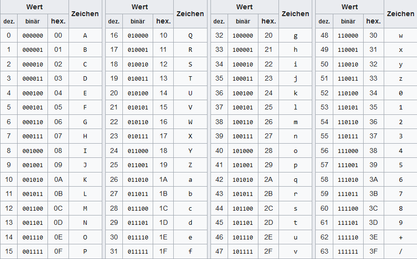

# 05 Datenaustausch
[TOC]

## Einleitung
Der Datenaustausch zwischen den einzelnen Systemkomponenten ist von zentraler Bedeutung in einem verteilten System. Dieses Kapitel befasst sich mit der Planung und Dokumentation von Schnittstellen aber auch mit den Protokollen und Datenformaten, die für den Datenaustausch verwendet werden. Ebenso werden Lösungsansätze wie **Message Broker** oder **Publisher/Subscriber-Pattern** erläutert, die helfen, die einzelnen Systemteile weiter voneinander zu entkoppeln.

## Planung und Dokumentation von Schnittstellen
Beim Planen einer Schnittstelle geht es primär darum zu überlegen, welche Dienste sollen gegen aussen (aus Sicht der Systemkomponente) exponiert werden - also zugänglich sein für die Verwendung durch andere Systemkomponenten. In einem nächsten Schritt wird dann für jeden angebotenen Dienst oder Endpunkt definiert, wie die Daten dem Dienst angeliefert werden bzw. wie der Dienst seine Antwort-Daten strukturieren soll.

Sinnvollerweise wird die Planung / Dokumentation bereits in einem maschinenlesbaren standardisierten Format wie beispielsweise als OpenAPI- oder GraphQL-SDL-Spezifikation erstellt. Insbesondere dann, wenn erst die Schnittstelle geplant und erst anschliessend umgesetzt werden soll (API-First-Ansatz), kann es sinnvoll sein ein standardisiertes und maschinenlesbares Format zu verwenden, weil dann aus der Dokumentation der Code teilweise automatisiert abgeleitet werden kann. Wenn die API bereits bestehend ist, bietet sich der Weg an, diese über Kommentare / Annotations im Code zu dokumentieren und dann aus dem Code eine übersichtlichere API-Dokumentation generieren zu lassen.

Die beiden Formate GraphQL und OpenAPI werden in den folgenden beiden Kapiteln kurz erklärt und in der Übungsaufgabe [Schnittstellenbeschreibung](./Schnittstellenbeschreibung.md) zur Vertiefung angewendet.

<!-- 
Notizen (work in progress):
Ev. noch Hinweise ergänzen, wie Schnittstellen geplant werden (gerade im Zusammenhang mit bereits bestehenden Systemen, wenn diese erweitert werden sollen)
//-->

### GraphQL
Bei GraphQL handelt es sich um "eine Abfragesprache und serverseitige Runtime für APIs" (Quelle: [RedHat](https://www.redhat.com/de/topics/api/what-is-graphql)). Die Idee ist es, möglichst nur die Daten zurückzugeben bzw. bei Anfragen mitzusenden, die tatsächlich verwendet werden. Vergleicht man GraphQL mit SOAP, so muss beispielsweise bei SOAP für jedes mögliche Feld (auch für die optionalen) ein Wert bzw. Leerwert angegeben werden. Bei GraphQL können diese Daten einfach weggelassen werden, was zu geringerem Bandbreitenbedarf und schnellerer Aufbereitung der Daten führt.

GraphQL verwendet für die Beschreibung der formalen Schnittstelle ein GraphQL Schema. Dieses Schema wird in der [GraphQL SDL (Schema Description Language)](https://www.apollographql.com/tutorials/lift-off-part1/03-schema-definition-language-sdl) beschrieben.

Gegeben ist eine einfache Schnittstelle für eine Systemkomponente, die TODOs verwaltet. Ein TODO hat eine ID, einen Titel und ein Boolean "completed" der speichert, ob das TODO offen oder erledigt ist. Die Schnittstelle bietet die Möglichkeit TODOs zu lesen, hinzuzufügen oder zu löschen.

In GraphQL SDL würde diese Schnittstelle beispielsweise wie folgt beschrieben (Beispiel generiert durch ChatGPT):
```GraphQL
# Das Schema beschreibt eine einfache API für ein ToDo-List-System.
type Query {
    # Holt alle ToDos
    todos: [Todo!]!
    
    # Holt ein einzelnes ToDo nach ID
    todo(id: ID!): Todo
}

type Mutation {
    # Fügt ein neues ToDo hinzu
    addTodo(input: AddTodoInput!): Todo
    
    # Löscht ein ToDo nach ID
    deleteTodo(id: ID!): Boolean
}

type Todo {
    id: ID!
    title: String!
    completed: Boolean!
}

input AddTodoInput {
    title: String!
    completed: Boolean
}
```

Um die Schnittstelle zu verwenden, müsste nun beispielsweise für das Auslesen eines TODOs mit der ID 3 folgende Anfrage an den GraphQL-Endpunkt gesendet werden:
```
query {
  todo(id: "3") {
    title
    completed
  }
}
```

Dabei können nur die Felder angefordert werden, die auch tatsächlich abgefragt werden sollen. Beispielsweise könnte nur title und completed abgefragt und die id beiseite gelassen werden. Dadurch wird auch die Antwort des Servers kürzer und wäre beispielsweise folgende:
```JSON
{
  "data": {
    "todo": {
      "title": "Einkaufen",
      "completed": false
    }
  }
}
```

Die Daten werden dabei als JSON-String zurückgegeben.

Um beispielsweise ein TODO hinzuzufügen, könnte folgende Anfrage gesendet werden:
```
mutation {
    addTodo(input: { title: "Arzttermin", completed: false }) {
        id
    }
}
```

Dann wird als Antwort nur die generierte ID in folgender Form zurückgesendet:
```JSON
{
  "data": {
    "addTodo": {
      "id": "4"
    }
  }
}
```

Möchten Sie sich weiter in dem Thema GraphQL vertiefen, ist die Seite https://www.apollographql.com/tutorials/ sehr zu empfehlen. Es ist eine Plattform mit interaktiven Tutorials rund um das Thema GraphQL. Die Kurse sind sehr ansprechend und lehrreich gestaltet.

<!--
Notizen:
https://www.redhat.com/de/topics/api/what-is-graphql
//-->

### OpenAPI
OpenAPI Specification begann früher unter dem Namen Swagger und wird unterstützt von SMARTBEAR - derselben Personen die auch SoapUI geschaffen haben (ein Tool für das Testing von SOAP-Schnittstellen - unter anderem). Weitere Details zu SoapUI sind weiter unten und im Kapitel [08 Monitoring und Logging, Testing und Debugging](../08%20Monitoring%20und%20Logging,%20Testing%20und%20Debugging/) beschrieben.

Die Definition von OpenAPI-Schnittstellen ist dabei etwas länger und unübersichtlicher wie bei GraphQL und verwendet YAML als Format (Beispiel generiert durch ChatGPT):
```YAML
openapi: 3.0.0
info:
  title: ToDo API
  version: 1.0.0
  description: Eine einfache API für eine ToDo-Liste.
paths:
  /todos:
    get:
      summary: Holt alle ToDos
      responses:
        '200':
          description: Eine Liste von ToDos
          content:
            application/json:
              schema:
                type: array
                items:
                  $ref: '#/components/schemas/Todo'
    post:
      summary: Fügt ein neues ToDo hinzu
      requestBody:
        description: Die Details des neuen ToDos
        required: true
        content:
          application/json:
            schema:
              $ref: '#/components/schemas/AddTodoInput'
      responses:
        '200':
          description: Das neu hinzugefügte ToDo
          content:
            application/json:
              schema:
                $ref: '#/components/schemas/Todo'
  /todos/{id}:
    get:
      summary: Holt ein einzelnes ToDo nach ID
      parameters:
        - in: path
          name: id
          required: true
          schema:
            type: string
      responses:
        '200':
          description: Ein einzelnes ToDo
          content:
            application/json:
              schema:
                $ref: '#/components/schemas/Todo'
        '404':
          description: ToDo nicht gefunden
    delete:
      summary: Löscht ein ToDo nach ID
      parameters:
        - in: path
          name: id
          required: true
          schema:
            type: string
      responses:
        '200':
          description: Erfolgreich gelöscht
        '404':
          description: ToDo nicht gefunden
components:
  schemas:
    Todo:
      type: object
      properties:
        id:
          type: string
        title:
          type: string
        completed:
          type: boolean
    AddTodoInput:
      type: object
      properties:
        title:
          type: string
        completed:
          type: boolean
```

Die Abfragen der Endpunkte wird über die URL gesteuert. Um beispielsweise das TODO mit der ID 3 auslesen zu können muss eine GET-Abfrage auf die URL /todos/3 gesendet werden. Als Antwort könnte dann beispielsweise der folgende JSON-String retourniert werden:
```JSON
{
  "data": {
    "todo": {
      "id": 3,
      "title": "Einkaufen",
      "completed": false
    }
  }
}
```

Eine Reduktion der Anzahl der zu retournierenden Felder aufgrund der gestellten Anfrage ist nicht vorgesehen. Dafür müsste ein Endpunkt definiert werden, der immer weniger retourniert.

Weitere Details zu OpenAPI sind unter https://swagger.io/solutions/getting-started-with-oas/ zu finden.


<!--
OpenAPI (früher Swagger): für Schnittstellendefinition von RESTful APIs, ist Maschinenlesbar (Swagger, Redoc, Postman)
GraphQL Schema Definition Language: GraphiQL, Apollo Studio
API-First Design: zuerst API spezifizieren, bevor diese Umgesetzt wird
Kommentare im Code und Generierung der Dokumentation daraus: Javadoc, Doxygen, Typedoc
Beispiele der Verwendung der API sollten in guter Dokumentation nicht fehlen (Postman Collections, bei Swagger/Redoc auch Beispiele möglich)
Version der Dokumentation bzw. Schnittstelle die Implementiert wurde
Interaktive Dokumentation (inkl. direktem Testing von API-Calls)

Swagger ist auch von Smartbear (gleiche Organisation die auch SoapUI gemacht hat)

GraphQL-Kurs: https://www.apollographql.com/tutorials/lift-off-part1 (nice)

Kotlin: von JetBrain entwickelt und bei der Android-Entwicklung unterstützt. Mutet etwas Java / JavaScript mässig bezüglich der unterstützten Features.
//-->

## Interprozesskommunikation - RPC (Remote Procedure Call)
Eine weitere Möglichkeit entfernte Systeme anzusprechen und dies in einer Weise wie, wenn diese lokal wären, sind sogenannte RPC (Remote Procedure Call). RPC ist eine "Technik zur Realisierung von Interprozesskommunikation" (Quelle: [Wikipedia](https://de.wikipedia.org/wiki/Remote_Procedure_Call)).

Eine konkrete Implementierung dieser Technik ist beispielsweise [gRPC - ein open source RPC Framework](https://grpc.io/). Dieses ist für mehrere Sprachen verfügbar. Wenn Sie sich gerne in die Thematik vertiefen wollen, ist [gRPC](https://grpc.io/) ein guter Einstiegspunkt.

## Datenaustauschformate
Um Daten über eine Schnittstelle auszutauschen, müssen diese in einem Format übertragen werden, dass beide Seiten verstehen. Normalerweise wird in einem verteilten System ein textbasiertes Datenaustauschformat verwendet.

Dies hat den Vorteil, dass in der Entwicklung die Schnittstelle einer Systemkomponente relativ einfach getestet werden kann. Testdaten können so durch den Entwickler einfach interpretiert und angepasst werden. Mit den angepassten Testdaten werden dann Requests an den Endpunkt der Systemkomponente (die Schnittstelle) gemacht, um zu testen, ob sich die Systemkomponente / Schnittstelle korrekt verhält.

Werden binäre Daten bzw. Objekte einer Applikation in Text umgewandelt, dann spricht man von **serialisieren**. Wird dieser Text anschliessend wieder in die konkreten binären Daten bzw. Objekte zurückgewandelt, dann spricht man von **deserialisieren**.

Die serialisierten Daten können dabei unterschiedliche Formate haben. Hier eine Auswahl von häufig verwendeten Formaten:
* JSON (JavaScript Object Notation): Das JSON-Format ist optimal geeignet um Objektdaten zu transferieren. Die Daten können etwas kompakter als bei XML formuliert werden, was zu geringeren Datenmengen und damit zu weniger Bandbreitenbedarf für die Applikation führt.
* XML: Wird heute vor allem im Zusammenhang mit SOAP eingesetzt (aber auch sonst noch bei der einen oder anderen Applikation). XML kann ebenfalls gut für Baumartige Datenstrukturen und für Objektdaten verwendet werden. Wenn auf der grünen Wiese gestartet werden kann, ist die Verwendung von JSON eher zu empfehlen (ausser im Zusammenhang mit SOAP - weil dort die Verwendung von XML durch das Protokoll vorgeschrieben ist). XML als Format ist bereits länger im Einsatz, wird aber nach und nach durch das Performantere JSON abgelöst.
* Base64: Base64 wird für die Codierung von binären Daten als ASCII-Zeichen verwendet. Dieses Format macht dann Sinn, wenn beispielsweise Bilddaten von Systemen übertragen werden, die nur das normale ASCII-Zeichenset verarbeiten können. Beispielsweise im Zusammenhang mit E-Mails wird häufig für die Anhänge an E-Mails Base64 verwendet, weil so sicher jeder Mailserver und Mailclient die Daten Verarbeiten kann. Jedoch nur die Systeme, die Base64 zurückwandeln können, werden verstehen, dass da ein Bild als Anhang im Mail war. Die anderen Systeme haben das Gefühl normale ASCII-Textdaten verarbeitet zu haben.


### Beispiele
#### JSON und XML
JSON und XML lassen sich relativ gut ineinander umwandeln. Wenn beispielsweise ein Produkt serialisiert von einer Systemkomponente in eine andere Systemkomponente übertragen werden soll, könnte dies so aussehen:

**JSON:**
```JSON
{
  "produkt": {
    "id": 101,
    "name": "Kabellose Maus",
    "beschreibung": "Eine schlanke und moderne kabellose Maus mit ergonomischem Design.",
    "preis": 29.95,
    "währung": "CHF",
    "auf_lager": true,
    "kategorien": ["Elektronik", "Zubehör", "Computer"],
    "eigenschaften": {
      "batterielaufzeit": "12 Monate",
      "verbindung": "Bluetooth",
      "farbe": "Schwarz"
    }
  }
}
```

**XML:**
```XML
<produkt>
  <id>101</id>
  <name>Kabellose Maus</name>
  <beschreibung>Eine schlanke und moderne kabellose Maus mit ergonomischem Design.</beschreibung>
  <preis>29.95</preis>
  <währung>CHF</währung>
  <auf_lager>true</auf_lager>
  <kategorien>
    <kategorie>Elektronik</kategorie>
    <kategorie>Zubehör</kategorie>
    <kategorie>Computer</kategorie>
  </kategorien>
  <eigenschaften>
    <batterielaufzeit>12 Monate</batterielaufzeit>
    <verbindung>Bluetooth</verbindung>
    <farbe>Schwarz</farbe>
  </eigenschaften>
</produkt>
```

Was auffällt: wegen Start- und End-Tags beim XML, wird XML generell etwas länger. Wenn ein Array von Elementen übermittelt werden soll - wie beispielsweise bei den Kategorien - dann ist eine Konvertierung von JSON zu XML nicht unbedingt klar wie die gemacht werden soll. Das XML enthält jetzt beispielsweise mehr Informationen wie das JSON, dass es sich bei den einzelnen Elementen um den Typ "Kategorie" handelt. Bei JSON sind es einfach Strings. Wenn die Information im XML nicht stehen soll, könnte die entsprechende Stelle auch als `<kategorien>Elektronik, Zubehör, Computer</kategorien>` formuliert werden. Dann ist aber das Problem: Was wird mit Kategorien gemacht, die im Kategorie-Namen ein Komma enthalten? Die würden dann nicht als eine Kategorie, sondern mehrere Kategorien interpretiert. 

Ein weiterer Unterschied ist, dass bei XML mit Attributen gearbeitet werden kann. So wäre es beispielsweise auch denkbar den Preis und die Währung in einem Tag abzubilden: `<preis währung="CHF">29.95</preis>`. Dies lässt sich dann so aber nicht auf JSON übertragen.

Eine Konvertierung zwischen JSON und XML ist grundsätzlich möglich. Es muss jedoch darauf geachtet werden, dass keine Features verwendet werden, die zueinander inkompatibel sind oder es muss für jede inkompatible Stelle definiert werden, wie damit umgegangen werden soll bzw. wie diese konvertiert werden soll.

#### Base64
Um Daten in Base64 umzuwandeln (bzw. von Base64 wieder zurück), sind Online-Converter hilfreich (Beispielsweise https://www.base64encode.org/de/ für das encoding und https://www.base64decode.org/de/ für das decoding). Beim Encoding werden Binär-Daten in entsprechende ASCII-Werte gemäss untenstehender Tabelle umgewandelt:

[Quelle Bild & weitere Details](https://de.wikipedia.org/wiki/Base64)

Gegeben ist Beispielsweise der Text **TBZ** (in Hex-Code: 54 42 5A, in Binärform: 01010100 01000010 01011010). Gemäss obenstehender Tabelle muss der Binärcode in Päckchen zu jeweils 6 Bit aufgeteilt werden. Für TBZ wäre dies 010101 000100 001001 011010. Gemäss obenstehender Tabelle wird nun 010101 zu V, 000100 zu E, 001001 zu J und 011010 zu a. D. h. **TBZ** wird in Base64 zu **VEJa**.

Sind die Bit der Daten nicht durch 6 Teilbar werden so viele 0-Bit ergänzt bis die Daten durch 6 Teilbar sind. Damit erkannt werden kann, wie viel ergänzt werden musste (2 Mal ein 0-Bit oder 4 Mal ein 0-Bit), wird dem Base64-Code ein sogenanntes Padding angehängt - bei zwei Bit **=** und bei 4 Bit **==**. 


## Publisher/Subscriber-Pattern
Beim Publisher/Subscriber-Pattern (auch Pub/Sub-Pattern genannt) geht es darum, dass ein Publisher Nachrichten oder Ereignisse sendet, ohne dabei die Subscriber direkt anzusprechen oder zu kennen. Subscriber können bestimmte Arten von Nachrichten oder Ereignissen abonnieren und erhalten die Nachrichten, sobald neue Nachrichten zur Verfügung stehen, die zu ihren Abos passen.

Das Publisher/Subscriber-Pattern wird oft durch ein **Message Broker** oder **Event Bus** implementiert. Dabei ist ein Event Bus etwas einfacher gestrickt und leitet die Nachrichten in der Regel direkt weiter. Ein Message Broker bietet zusätzliche Funktionalitäten wie beispielsweise das Zwischenspeichern von Nachrichten bis diese durch die Subscriber empfangen werden können. Dadurch werden Publisher und Subscriber auch zeitlich voneinander unabhängig. Ein Vergleich zwischen Message Broker, Event Bus und Message Queue (alle tun sehr ähnliche Dinge) der etwas mehr in die Tiefe geht, ist in diesem [Artikel](https://pandaquests.medium.com/difference-between-event-bus-message-queue-and-message-broker-a8630a8823f7) zu finden.

### Message Broker
Ein Message Broker ist eine Middleware bzw. ein Vermittler, der zwischen zwei Systemkomponenten vermittelt und diese voneinander unabhängiger macht (entkoppelt). Ein Message Broker ist in der Lage die Dienste zeitlich voneinander zu entkoppeln (dank Zwischenspeicherung der Nachrichten). Je nach Features, die der Message Broker bietet, kann er aber auch die Nachrichten vom Format her konvertieren. Beispielsweise erwartet der eine Service XML der andere JSON. So kann der Message Broker die Konvertierung übernehmen. In folgendem [Wikipedia-Artikel](https://en.wikipedia.org/wiki/Message_broker) ist ein Diagramm zu finden, wie die Kommunikation zwischen dem Message Broker und den einzelnen Systemkomponenten funktioniert. Ebenso enthält der Artikel eine Liste von konkreten Implementierungen der "Message Broker Idee".

Je nach angebotenen Features eines konkreten Message Brokers kann dieser auch eine Lastenverteilung anbieten. Wenn beispielsweise mehrere Subscriber von einer Message-Queue Nachrichten beziehen und der Message Broker in der Lage ist sicherzustellen, dass jede Nachricht nur genau von einem Subscriber empfangen werden kann, dann könnten Arbeitsanweisungen in Message Queues erfasst und dann durch mehrere Subscriber parallel abgearbeitet werden. Dabei kann der Message Broker auch bei den Nachrichten priorisieren und filtern und so noch besser die Abarbeitung der Nachrichten steuern.

## Testing-Tools für Schnittstellen
Stellen Sie sich vor, Sie haben zwei Systemkomponenten - einerseits ein Webinterface, das AJAX-Requests an ein Backend sendet und andererseits, das Backend, welches die Requests entgegennimmt, verarbeitet und an das Webinterface zurücksendet. Um in einem solchen Szenario sauber entscheiden zu können, welche der beiden Systemkomponenten (Webinterface oder Backend) die Schnittstelle nicht sauber bedient / implementiert, ist es sinnvoll nur eine Seite in "Laborbedingungen" (kontrollierbaren Bedingungen) zu testen. Dafür kommen in der Regel Tools zum Einsatz, die Requests generieren können und diese dann an den Endpunkt der Systemkomponente senden und die Response der Systemkomponente entgegennehmen und anzeigen können.

Folgende Tabelle listet eine Auswahl von möglichen Tools auf, die Requests generieren, senden und die Response anzeigen können und dadurch gut für das Testing von Schnittstellen geeignet sind:

| Tool                        | Beschreibung                                                                                                                                                                                                                                                                                                                                                                                                                                                                                                                                                                                                                                                                                                                                                                                             | Quelle                                                                                                                                                                                                                                                                                                                                                                                                                                                                                          |
|-----------------------------|----------------------------------------------------------------------------------------------------------------------------------------------------------------------------------------------------------------------------------------------------------------------------------------------------------------------------------------------------------------------------------------------------------------------------------------------------------------------------------------------------------------------------------------------------------------------------------------------------------------------------------------------------------------------------------------------------------------------------------------------------------------------------------------------------------|-------------------------------------------------------------------------------------------------------------------------------------------------------------------------------------------------------------------------------------------------------------------------------------------------------------------------------------------------------------------------------------------------------------------------------------------------------------------------------------------------|
| SoapUI                      | SoapUI ist optimal im Zusammenhang mit SOAP-Schnittstellen (um diese zu testen). Die Grundstruktur der XML-Daten die bei SOAP an den Endpunkt gesendet werden sollen, lassen sich aus der WSDL-Definition der Schnittstelle mit SoapUI automatisiert generieren. Dadurch nimmt das Tool dem Entwickler viel Arbeit bei der Erstellung von Testdaten für den Request ab. Gemäss Hersteller werden aber auch andere Protokolle (REST, SOAP, GraphQL und JMS) unterstützt. SoapUI steht als OpenSource-Variante zur Verfügung                                                                                                                                                                                                                                                                               | https://www.soapui.org                                                                                                                                                                                                                                                                                                                                                                                                                                                                          |
| Postman                     | Postman ist eine Proprietäre Lösung, die auch als Free-Variante zur Verfügung steht. Postman unterstützt bei allen Arten von HTTP-Requests (über HTTP und HTTPS). Das Tool ermöglicht es, massgeschneiderte HTTP-Requests abzuschicken. Es unterstützt alle gängigen HTTP-Methoden (GET, PUT, POST, DELETE, etc.) aber auch Themen wie [HTTP-Authentifizierung](https://de.wikipedia.org/wiki/HTTP-Authentifizierung) sind möglich.                                                                                                                                                                                                                                                                                                                                                                      | https://www.postman.com                                                                                                                                                                                                                                                                                                                                                                                                                                                                         |
| Entwickler-Tools im Browser | In der Regel sind bei allen bekannteren Browsern Entwickler-Tools (Developer-Toolbar) bereits vorinstalliert. Durch drücken der Taste F12 (oder über das Kontextmenü des jeweiligen Browsers) können die Entwickler-Tools einfach aktiviert werden. Die Developer-Toolbar ist eher dafür gedacht, um webseiten zu entwickeln. Sie enthalten aber auch einen Tab "Netzwerk" über welchen geschaut werden kann, welche Daten die Webseite über das Netzwerk versendet (inkl. aller Header-Informationen). Die Requests können entweder 1 zu 1 nochmals an die API gesendet werden. Sie haben aber auch die Option, Daten nochmals zu verändern bevor der Request gesendet wird. Wenn Sie diese Option wählen, dann sind alle Daten bereits vorausgefüllt und Sie können dies für Ihre Testzwecke anpassen. | <ul><li>Google Chrome: https://developer.chrome.com/docs/devtools</li><li>Firefox Developer Edition: https://www.mozilla.org/en-US/firefox/developer/</li><li>Firefox: https://firefox-source-docs.mozilla.org/devtools-user/</li><li>Microsoft edge: https://learn.microsoft.com/de-de/microsoft-edge/devtools-guide-chromium/overview</li><li>Safari for developers: https://developer.apple.com/safari/</li><li>Safari: https://support.apple.com/de-ch/guide/safari/sfri20948/mac</li></ul> |


<!--
Notizen (work in progress):
Schnittstellen definieren, dokumentieren und umsetzen

Sowohl Schnittstellenprotokolle / Datenaustausformate als auch Testing-Tools anschauen

https://graphql.org/ -> Wunschthema für Schnittstellen

Asynchrone Kommunikation (beispielsweise mit Kafka)... Messsage Broker

Publisher/Subscriber-Pattern (bei Datenaustausch)

Wo passt RPC mit rein? Ist RPC ein Datenaustauschformat?

//-->