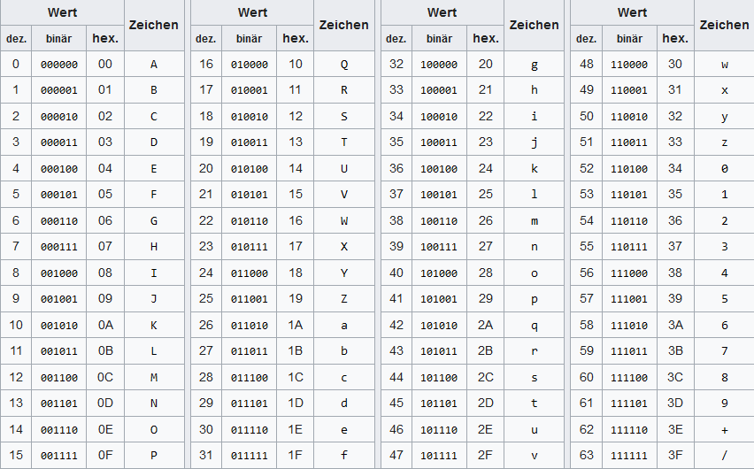

# 01 Aufbau verteilter Systeme
[TOC]

## Einleitung
Ein verteiltes System ist eine Sammlung bestehend aus voneinander unabhängigen Applikationen. Diese werden üblicherweise verteilt über mehrere Rechnerknoten (nodes) hinweg betrieben. Die Applikationen Arbeiten zusammen (Datenaustausch über Schnittstellen / API's), um ein gemeinsames Ziel zu erreichen. ([Umfangreichere Beschreibung](https://www.atlassian.com/de/microservices/microservices-architecture/distributed-architecture))

Aufgrund der Definition ist klar, dass ein verteiltes System aus folgenden Komponenten besteht:
- Voneinander unabhängige Rechner (nodes), wo die einzelnen Softwareteile darauf laufen
- Schnittstellen zwischen den Softwareteilen
- Eine gemeinsame Datenbasis: Diese muss zwischen den unterschiedlichen Teilen synchron gehalten werden. Die Synchronisation der gemeinsamen Datenbasis kann insbesondere beim Ausfall einzelner Komponenten und der anschliessenden Wiederherstellung des Systems eine grosse Herausforderung darstellen (weitere Details siehe [04 Datenhaltung](../04%20Datenhaltung)).

Dadurch, dass die einzelnen Teile unabhängig voneinander sind, ist in der Regel eine Skalierung auch relativ gut umsetzbar (weitere Details siehe [07 Skalierung](../07%20Skalierung)).

Weil bei verteilten Systemen mehrere Rechner miteinander zusammenarbeiten, stellen sich zusätzliche Herausforderungen in Bezug auf Monitoring des Gesamtsystems aber auch bezüglich Testing und Debugging (Details in Kapitel [08 Monitoring und Logging, Testing und Debugging](../08%20Monitoring%20und%20Logging,%20Testing%20und%20Debugging)). Aber auch das Setup von der Entwicklungsumgebung, die auf einem Rechner das gesamte verteilte System simuliert, kann herausfordernd sein. Dank Technologien wie Container oder Infrastructure as Code existieren heute viele Möglichkeiten, wie ein komplettes verteiltes System auf einem Rechner lokal betrieben werden kann (Details lernen Sie im Kapitel [02 Lokale Entwicklungsumgebung](../02%20Lokale%20Entwicklungsumgebung) kennen). Wichtig ist im Zusammenhang mit der sauberen Begriffsdefinition aber darauf zu achten, dass - selbst wenn das verteilte System lokal komplett "simuliert" wird - man bei Entwicklungsumgebungen dann **nicht** mehr von einem verteilten System spricht, weil **nur ein Rechner involviert** ist in den Betrieb des Systems. Ob etwas ein verteiltes System ist oder nicht hängt stark davon ab, wie das System installiert wurde. Die Konzepte die verteilte Systeme nutzen können in lokalen Entwicklungsumgebungen häufig einfacher analysiert und erlernt werden, weshalb die in den Übungsaufgaben zu erstellenden Systeme häufig keine verteilten Systeme sind. Die Grundkonzepte können aber einfach auf die tatsächlich verteilten Systeme angewendet werden.

## Beispiel eines verteilten Systems
Eine Webapplikation mit Frontend, Backend und wenn möglich weiteren Umsystemen ist bereits ein Beispiel für ein verteiltes System (siehe Bild).


Dabei läuft die Logik der Webapplikation auf der Serverseite (Webserver und Datenbank-Server sowie allfällige Webservices) in einem Rechencenter während die Clients (in der Regel die Browser der Webseitenbesucher) auf den Laptops/Mobiles der Webseitenbesucher laufen. Aber nicht nur Webapplikationen gelten als verteiltes System. Auch beispielsweise Dienste wie OneDrive von Microsoft, die es ermöglichen, Dateien zwischen mehreren Endgeräten synchron zu halten, sind verteilte Systeme. Sobald eine Applikation über die Grenzen des eigenen Servers via Netzwerk mit anderen Teilen kommuniziert und so ein Gesamtsystem bildet, wird von verteiltem System gesprochen.

## Ziele von verteilten Systemen
Die folgenden Ziele werden mit einem verteilten System verfolgt:
- **Skalierbarkeit:** Ändert sich das Nutzerverhalten (viel oder wenig User die das System nutzen), dann lässt sich ein verteiltes System einfacher skalieren. Für eine konkrete Aufgabe im System können bei Engpässen einfach neue Knoten dazu gehängt werden (oder wieder entfernt werden, wenn die Leistung nicht mehr benötigt wird).
- **Parallele Verarbeitung:** Dank mehreren Knoten die dieselben Aufgaben erfüllen können, kann eine parallele Verarbeitung stattfinden. Dadurch wird die Latenz (Wartezeit auf die Antwort der Applikation) reduziert.
- **Stabilität / Fehlertoleranz:** Wenn die einzelnen Teile im verteilten System mehrfach (redundant) vorhanden sind, kann die Arbeit beim Ausfall eines Knotens auf die verbleibenden Knoten verteilt werden. Das Gesamtsystem wird dadurch nur etwas langsamer aber fällt nicht komplett aus - ist fehlertolerant.
- **Dezentralisierung und Autonomie:** Dadurch dass die einzelnen Teile unabhängig voneinander betrieben werden können und nicht durch eine zentrale Einheit gesteuert werden müssen, wird die Stabilität und Fehlertoleranz des Gesamtsystems weiter erhöht.
- **Geografische Verteilung:** Dadurch, dass die Knoten unabhängig voneinander betrieben werden können und abhängig von der Anwendung auch nicht übermässig viel Daten austauschen müssen, ist es einfacher möglich die verschiedenen Knoten auch geografisch zu Verteilen. Dadurch wird ein Ausfall des Gesamtsystems verhindert, wenn beispielsweise ein Brand in einem Rechenzentrum dieses (inkl. aller dort gehosteten Knoten) in die Knie geht. Die Knoten an einem anderen Standort können in so einem Fall einfach die Last übernehmen bis ein Ersatz für den ausgefallenen Teil aufgebaut wurde.
- **Kostenreduktion / bessere Ressourcenausnutzung:** Dieses Ziel hängt mit der Skalierbarkeit zusammen. Wird das verteilte System bei unregelmässiger Nutzung herunterskaliert, dann können - insbesondere im Cloud-Umfeld - Rechnerressourcen, die nicht mehr benötigt werden, ausgeschalten werden. Wenn die Nutzung wieder ansteigt, werden die Knoten einfach wieder neu dazu genommen.
- **Flexibilität / Modularität:** Dadurch, dass die einzelnen Teile des Systems unabhängig voneinander Betrieben werden können, kann das Gesamtsystem einfach erweitert oder aktualisiert werden, ohne dieses vom Netz zu nehmen. Beispielsweise für eine Aktualisierung werden Knoten für Knoten vom System getrennt, aktualisiert und anschliessend wieder verbunden, bis das Gesamtsystem aktualisiert wurde. Dadurch werden Ausfallzeiten wegen Wartung vermieden. Erweiterungen des Systems funktionieren ähnlich und ohne dass das System dafür vom Netz genommen werden müsste.

Um diese Ziele zu erreichen, müssen einige zentrale Problemstellungen gelöst werden:
- **Gemeinsame Datenbasis:** In verteilten Systemen gibt es viele Kopien der Daten, damit die einzelnen Teile autonom betrieben werden können. Dies bedeutet aber auch, dass die Daten miteinander synchron gehalten werden müssen. Wenn ein Knoten etwas an den Daten ändert, dann müssen das alle anderen Knoten möglichst zeitnah erfahren, um ihre Berechnungen / Entscheidungen aufgrund der aktuellen Daten zu treffen.
- **Lastenverteilung:** Um die Skalierbarkeit, parallele Verarbeitung und Fehlertoleranz erreichen zu können, müssen die Arbeitslasten sinnvoll verteilt werden können. D. h. es braucht Komponenten, die wissen, welche Knoten (Nodes) wie Stark ausgelastet sind und entsprechend die Aufgaben möglichst fair verteilen. Diese Problemstellung ist nicht ganz so einfach zu lösen. Dies hängt insbesondere damit zusammen, dass auch der Loadbalancer Fehlertolerant / Redundant sein sollte, damit ein Ausfall des Loadbalancers nicht zu einem kompletten Systemausfall führen kann.
- **Bandbreite und Latenz zwischen Systemkomponenten:** gerade wenn das System auch geografisch verteilt werden soll ist es wichtig, dass die einzelnen Teile eine gute und stabile Verbindung zueinander haben. Wenn die Bandbreite aber nur sehr beschränkt zur Verfügung steht, muss geschaut werden, ob bzw. wie der Datenaustausch zwischen den Knoten reduziert werden kann, um Bandbreite zu sparen. Bei Echtzeitanwendungen spielt zusätzlich die Latenz eine Rolle, die - wenn sie zu hoch ist - zu Problemen führen kann.

Weil alle diese Problemstellungen gelöst werden müssen, ist ein verteiltes System ist grundsätzlich komplexer aufgebaut wie ein nicht verteiltes System. Dadurch wird das Debuggen und Überwachen des Gesamtsystems etwas schwieriger. Für alle diese Problemstellungen werden wir in diesem Modul Lösungsansätze, Konzepte und Technologien kennenlernen, mit denen die Probleme angegangen und gelöst werden können.

## Typische Systemkomponenten in einem verteilten System
Als Systemkomponente wird ein konkreter Bestandteil eines verteilten Systems bezeichnet. Das verteilte System baut sich aus verschiedenen Systemkomponenten auf. Die konkreten Systemkomponenten lassen sich nach Aufgabenbereich kategorisieren.

| Kategorie                                  | Beschreibung                                                                                                                                                                                                                                                                                                                                                                                                                                                                                                                                                                                                                                                                                             | Beispiele                                                                                                                                                                                         |
|--------------------------------------------|----------------------------------------------------------------------------------------------------------------------------------------------------------------------------------------------------------------------------------------------------------------------------------------------------------------------------------------------------------------------------------------------------------------------------------------------------------------------------------------------------------------------------------------------------------------------------------------------------------------------------------------------------------------------------------------------------------|---------------------------------------------------------------------------------------------------------------------------------------------------------------------------------------------------|
| Datenkomponenten                           | Datenbanken oder Dateisysteme, die eine persistente Datenspeicherung innerhalb der verteilten Systeme ermöglichen.                                                                                                                                                                                                                                                                                                                                                                                                                                                                                                                                                                                       | Relationale Datenbanken wie MySQL, MS-SQL, PostgreSQL oder auch NoSQL-Datenbanken wie MongoDB<br/>Cluster-Filesysteme wie GlusterFS oder Ceph (https://de.wikipedia.org/wiki/Cluster-Dateisystem) |
| Lastenverteilung und Failover              | Durch die Lastenverteilung werden die zu verarbeitenden Anfragen sinnvoll auf die zur Verfügung stehenden Rechner verteilt. Ein Failover sorgt dafür, dass die Last des ausfallenden Nodes auf die verbleibenden noch aktiven Nodes verteilt wird. So bleibt das Gesamtsystem verfügbar. In der Regel lassen sich Lastverteilung und Failover gut in einem kombinieren.                                                                                                                                                                                                                                                                                                                                  | Eureka Server                                                                                                                                                                                     |
| Management- und Orchestrierungskomponenten | Eng verwandt mit Lastenverteilung und Failover. Es handelt sich um Komponenten, die das Gesamtsystem steuern können. Diese Komponenten können in der Regel auch für Lastenverteilung und Failover eingesetzt werden.                                                                                                                                                                                                                                                                                                                                                                                                                                                                                     | Kubernetes, Docker Swarm, Vagrant, Terraform                                                                                                                                                      |
| Benutzerverwaltung und Berechtigungen      | Zentrale Benutzerverwaltung / Anmeldung / Berechtigung. Die Systemkomponenten die dies tun werden unter dem Kürzel IAM (Identity Access Management) zusammengefasst.                                                                                                                                                                                                                                                                                                                                                                                                                                                                                                                                     | Identity Provider (z. B. Login über Microsoft als identity provider), OAuth - Protokoll für delegierte Zugriffsauthentifizierung (ermöglicht SSO), MFA                                            |
| Service-Management                         | Die zur Verfügung stehenden Services haben in einem dynamischen Umfeld manchmal ändernde Endpunkte. Um die aktuell gülten Endpunkte zu finden (Service discovery) können Service registries eingesetzt werden, die das auffinden der aktuell zur Verfügung stehenden Services erleichtern.                                                                                                                                                                                                                                                                                                                                                                                                               | Eureka Server                                                                                                                                                                                     |
| Proxy-Systeme, Message broker, RPC         | Komponenten, die zwischen den Bestandteilen eines Systems stehen und dazu dienen sollen, die Systeme voneinander unabhängiger zu machen. Kommuniziert ein Service über einen Proxy mit einem anderen Service, dann bemerkt es nicht, wenn der andere Service durch eine neue Version ersetzt wird, weil sich dank dem Proxy der Endpunkt nicht ändert. Wird ein Message broker eingesetzt, dann kann dieser sogar die Daten für den Zielservice zwischenspeichern, bis dieser die Daten benötigt / abholt. Das Ursprungssystem schickt die Daten einfach an den Broker (nach dem Prinzip: fire and forget). Mit RPC (Remote Procedure Call) werden Funktionsaufrufe an entfernte Systeme weitergeleitet. | Apache Kafka, NGINX Reverse Proxy, Thrift (Framework für RPC)                                                                                                                                     |
| Monitoring und Debugging                   | Überwachung der Komponenten im verteilten System. Die Systemkomponenten dieser Kategorie können auch teilweise automatisiert Massnahmen zur Fehlerbehebung einleiten.                                                                                                                                                                                                                                                                                                                                                                                                                                                                                                                                    | -                                                                                                                                                                                                 |

Die Tabelle nennt nur sehr wenige Beispiellösungen. Es existieren diverse weitere Lösungen, die hier nicht genannt wurden. In der Übungsaufgabe [Recherche Systemkomponenten](./RechercheSystemkomponenten.md) eignen Sie sich vertieftes Wissen über eine / mehrere Kategorien Ihrer Wahl an (inkl. Vergleich der verfügbaren Softwarelösungen und deren Features bzw. Limitierungen).

## Quellen & weiterführende Vertiefung
- https://www.atlassian.com/de/microservices/microservices-architecture/distributed-architecture - Erläuterung zu Microservices
- https://de.wikipedia.org/wiki/Cluster-Dateisystem - Vertiefung in Cluster-Filesysteme
- https://en.wikipedia.org/wiki/Message_broker - Spannend wegen der Liste an möglichen Softwarelösungen für Message broker
# 02 Lokale Entwicklungsumgebung
[TOC]

## Ziele
Dieses Kapitel soll einen Überblick über die wichtigsten Tools und Technologien geben, die für die lokale Entwicklung zum Einsatz kommen.

## Grundsätze für die lokale Entwicklung
Um ein verteiltes System möglichst realitätsnah lokal testen zu können müssen die einzelnen Server / Systemkomponenten virtualisiert werden. Ebenso muss das Netzwerk virtualisiert werden. Aus Sicht der Systemkomponenten ist der Unterschied zwischen einem virtualisierten Netzwerk und einem physischen Netzwerk nicht zu erkennen. Dadurch wird es möglich, das Gesamtsystem, welches normalerweise über mehrere Rechner verteilt wird, auf einem Rechner zu virtualisieren.

Eine Voraussetzung für die Entwicklung von verteilten Systemen ist jedoch ein Rechner zu besitzen, der genügend Leistung bietet um mehrere Systeme parallel virtualisiert betreiben zu können. Je nach Grösse bzw. Performance-Anforderungen des Systems kann ein älteres bzw. nicht ganz so leistungsfähiges Gerät schnell an seine Grenzen stossen.

## Tools für die Virtualisierung
Um die verschiedenen Server bzw. Systemkomponenten auf dem Entwicklungsrechner betreiben zu können sind Tools für die Virtualisierung der Systemkomponenten nötig. Ein verteiltes System kann mit Containern oder mit virtuellen Maschinen (VM) betrieben werden.

### Engines für den Betrieb virtueller Maschinen (VM)
Der folgende Abschnitt befasst sich nur mit verteilten Systemen, die mit einzelnen Servern (VMs) realisiert wurden. Container werden im nächsten Kapitel behandelt.

Die folgende Tabelle ist nicht abschliessend, gibt aber einen Überblick über mögliche Software-Lösungen, die es erlauben VMs auf dem lokalen Rechner zu betreiben:

| Software             | Beschreibung                                                                                                                                                                                                                                                                                                |
|----------------------|-------------------------------------------------------------------------------------------------------------------------------------------------------------------------------------------------------------------------------------------------------------------------------------------------------------|
| Oracle VM VirtualBox | VirtualBox ist eine weit verbreitete OpenSource-Lösung, die von Oracle gepflegt und weiterentwickelt wird.<br/>https://www.virtualbox.org/                                                                                                                                                                  |
| Hyper-V              | Ist von Microsoft und im Windows bereits mit integriert. Ab Windows 10 steht Hyper-V im System zur Verfügung.<br/>https://learn.microsoft.com/de-de/virtualization/hyper-v-on-windows/about/                                                                                                                |
| VMWare               | VMWare ist eine proprietäre Lösung, die aber weit verbreitet ist. VMWare war eines der ersten Unternehmungen überhaupt, die eine Engine für virtuellen Maschinen entwickelte und gilt auch heute noch als führend in dem Bereich (auch im Zusammenhang mit Clustering und VMs).<br/>https://www.vmware.com/ |
| KVM, QEMU            | KVM steht für Kernel-based Virtual Machine und QEMU für Quick Emulator. Beide werden häufig in Kombination und vor allem unter Linux eingesetzt. Die Unterschiede und das Zusammenspiel der beiden wird unter https://cloudzy.com/blog/qemu-vs-kvm/ erklärt.                                                |

Wird ein verteiltes System lokal für die Entwicklung aufgesetzt, dann bedeutet dies, dass alle VMs für alle vorhandenen und im Testing involvierten Systemkomponenten aufgebaut und richtig konfiguriert werden müssen. Dies kann unter Umständen ein relativ zeitintensives Unterfangen sein, sofern dies nicht automatisiert geschieht.

Für das automatisierte Setup der verschiedenen Systemkomponenten (VMs) in einem verteilten System kann beispielsweise Vagrant verwendet werden (Terraform wäre auch eine Möglichkeit, ist aber dann eher auf das deployment eines verteilten Systems auf der Produktivumgebung gedacht, weshalb wir Terraform hier nicht weiter betrachten). Bei Vagrant wird beschreibend angegeben, welche VMs und welche Netzwerke angelegt werden sollen. Es wird zudem angegeben welcher "Provider" für das Anlegen der VMs verwendet werden soll. Unter Provider versteht man, auf welcher VM-Engine die VMs und das Netzwerk zwischen den VMs aufgebaut werden soll. Wird beispielsweise VirtualBox als Provider verwendet, dann werden die VMs innerhalb von VirtualBox erstellt (bei Hyper-V analog in Hyper-V, etc.) und können im Anschluss auch über die VirtualBox-Oberfläche überprüft und verwaltet werden.

Viele Beispiele von Vagrant-Setup's sind unter https://gitlab.com/ch-tbz-it/Stud/m169/-/tree/main/vagrant zu finden. Im [Modul 169](https://gitlab.com/ch-tbz-it/Stud/m169) (gehört zum Lehrgang der Plattformentwickler) wird auf das Thema IaC (Infrastructure as Code) noch detaillierte eingegangen. Ein Blick in dieses Modul kann dann nützlich sein, wenn Sie sich im Umgang mit Vagrant (oder auch mit Terraform) weiter vertiefen möchten.

Bei der Übungsaufgabe unter [04 Datenhaltung](../04%20Datenhaltung/Cluster-Dateisystem.md) werden Sie Vagrant einsetzen, um die verschiedenen Server eines Cluster-Filesystems auf Ihrem lokalen Rechner als VMs automatisiert aufsetzen zu lassen.

### Containerumgebungen
Eine zweite Möglichkeit ist es nicht virtuelle Maschinen (VMs), sondern Container zu verwenden. Im [Modul 347](https://gitlab.com/ch-tbz-it/Stud/m347) haben Sie den Umgang mit Containern bereits ausführlich kennengelernt. Deshalb hier nur kurz zur Repetition eine Übersicht der relevanten Software / Technologien:
* Docker: Container-Engine (neben Docker gäbe es auch noch andere wie beispielsweise PodMan)
* Kubernetes: Orchestrierungslösung für Container. Diese gibt es in verschiedenen Varianten auch als "single-node"-Cluster für die lokale Entwicklung.

## Tools für das Testing von Schnittstellen
Im Zusammenhang mit der lokalen Entwicklung von Software ist auch ein schnelles Testing und Debugging wichtig. In nicht verteilten Applikationen wird üblicherweise mit Breakpoints gearbeitet. Gerade im Zusammenhang mit den verteilten Komponenten gibt es zusätzliche Herausforderungen. Eine Arbeit mit Breakpoints ist nicht unbedingt praktikabel. Denn wenn auf einer Systemkomponente bei einem Breakpoint gehalten wird, dann haben die anderen Systemkomponenten den Eindruck, dass die im Debugging befindliche Systemkomponente nicht mehr reagiert - obwohl dies in Tat und Wahrheit nicht zutrifft. Dadurch reagiert das Umsystem unter Umständen anders, wie wenn nicht debugged wird. Es gibt auch weitere Herausforderungen (beispielsweise Timing - nicht alle Systeme haben die gleiche Uhrzeit). Weitere Details werden erst im Kapitel [08 Monitoring und Logging, Testing und Debugging](../08%20Monitoring%20und%20Logging,%20Testing%20und%20Debugging) besprochen.

Wichtig für die lokale Entwicklung und die Einrichtung der Entwicklungsumgebung zu wissen ist jedoch, dass es für das Debugging verteilter System Lösungsansätze gibt. Neben Lösungsansätzen wie dennoch mit Breakpoints gearbeitet werden kann, gibt es auch Ansätze, dass die Systemkomponenten selbst Logfiles Ihrer Aktivitäten schreiben. Es existieren Softwarelösungen, um die Logfiles mehrerer Komponenten parallel anzeigen zu lassen. Es gibt auch die Möglichkeit "on demand" ein Logging oder eine Debugging-Ausgabe anzuschalten auf einer Systemkomponente die gerade Untersucht werden soll. Nicht alle Lösungen sind für alle Programmiersprachen geeignet oder passen für Ihren konkreten Anwendungsfall. Deshalb hilft hier nur "selbst recherchieren", welche Lösung für Sie am besten passt. Aber wichtig: es gibt für praktisch alles eine Lösung. Eine kurze Suche wie in Ihrem Fall unter Einsatz der durch Sie gewählten Technologien am besten getestet wird, kann hilfreich sein.

Im Zusammenhang mit dem Datenaustausch - also um konkrete Schnittstellen zu testen - gibt es eigene Tools die auch bei der lokalen Entwicklung eingesetzt werden können. Diese werden im Kapitel [05 Datenaustausch](../05%20Datenaustausch) behandelt.

<!--
Notizen (work in progress):
Remote Debugger -> Breakpoints in IDE setzen und mit Remote Debugger verbinden (wenn Deployment von Code auf entfernten Rechner geht)
https://www.jetbrains.com/help/idea/tutorial-remote-debug.html
https://learn.microsoft.com/en-us/troubleshoot/developer/visualstudio/debuggers/troubleshooting-remote-debugging
https://code.visualstudio.com/docs/editor/debugging
...

Debugging von Problemen unter Last

http://inet.haw-hamburg.de/teaching/ws-2019-20/verteilte-systeme-1/07_verteiltesdebugging.pdf

Unterschiedliche Latenzen -> Timing-Probleme

Breakpoint auf einem System bewirkt das anderes System denkt, das eine System wäre tot... ob wohl es noch am Leben ist. Dadurch andere reaktion durch Umsysteme möglich
//-->


## Zugriff auf LernMAAS 
Das LernMAAS bietet Ihnen eine bereits vorinstallierte Arbeitsumgebung auf einer Linux-VM. Diese werden wir im Rahmen der Projektarbeit (LB2) einsetzen. Es erhält jeder Lernende eine eigene VM. Auf dieser setzt er seine Systemkomponente des verteilten Systems auf und verbindet diese mit den andern Systemteilen der anderen Gruppenmitglieder.

Die Lehrperson wird Ihnen für die Einrichtung von WireGuard und die Zuteilung Ihrer VM entsprechend die Zugangsdaten zukommen lassen. Eine Beschreibung was das LernMAAS grundsätzlich ist und eine Hands-On-Übung wie Sie den Zugriff testen und die Zugangsdaten für sich abändern können, finden Sie unter https://gitlab.com/ch-tbz-it/Stud/m347/-/tree/main/LernMAAS. Bitte stellen Sie möglichst bald sicher, dass der Zugriff auf Ihre VM klappt, um optimal auf den Start der LB2 vorbereitet zu sein und bei allfälligen Problemen noch genügend Zeitreserve zu haben, diese zu lösen.
# 03 Migration zu verteiltem System
Die Migration hin zu verteilten Systemen ist meist mit der Umstrukturierung der Applikation verbunden. Dabei müssen die Teile identifiziert werden, die eine logische Einheit bilden und diese voneinander so weit wie möglich entkoppelt werden. Üblicherweise liegen in monolithischen Systemen enge Kupplungen zwischen logisch getrennten Teilen vor. Für die Migration hin zu verteilten Systemen müssen die engen Kupplungen gelöst und durch klar definierte Schnittstellen ersetzt werden. Sollen die Teile auch "zeitlich" voneinander entkoppelt werden, können Systeme, wie beispielsweise ein Message Broker, zum Einsatz kommen.

## Beispiel
Es liegt ein Lagerhaltungssystem vor, dass auf dem Rechner des Lageristen installiert wurde. Das Lagerhaltungssystem gibt dem Lageristen die Möglichkeit, nach Produkten innerhalb des Lagers zu suchen, neue Produkte dem Lager hinzuzufügen oder Produkte aus dem Lager entfernen. Um die Software an unterschiedliche Lager-Situationen anpassen zu können, lassen sich auch die Anzahl der Regale und Ebenen (sprich die Lagerpositionen) verwalten.

Als Monolith ist Datenhaltung und Logik alles in einer Applikation enthalten. Wenn die Applikation nun auf eine verteilte Applikation umgebaut werden soll, müssen erst die logisch zusammengehörenden Einheiten erkannt werden. Im vorliegenden Beispiel wären dies:
* Lagerpositionen (inkl. Datenhaltung)
* Produktverwaltung (inkl. Produktdaten)
* Logging der Lagerbewegungen (inkl. Logdaten)
  * Einbuchen von angelieferten Produkten
  * Ausbuchen von ausgelieferten Produkten
  * Verändern der Lagerposition von bestehenden Produkten
* Suche nach Produkten

Wichtig bei verteilten Systemen ist, dass die Daten und die Logik die zusammengehört in der Regel gemeinsam losgelöst werden. Üblicherweise werden deshalb mehrere Datenbanken angelegt (Für Lagerpositionen, Produktdaten, Logdaten und gegebenenfalls Suchhistorie jeweils eine). Die Datenbanken und auch die Logik-Teile werden dadurch kleiner und überschaubarer. 

Wichtig: Die Aufteilung ist nur ein möglicher Vorschlag. Die Applikation könnte auch noch weiter bzw. anders unterteilt werden. Es gibt nicht die eine richtige Lösung. Manchmal werden auch Teile vorerst zusammen gelassen und erst später aufgetrennt. So könnte beispielsweise die Lagerposition auch enthalten, welches Produkt aktuell auf Ihr gelagert wird. Es könnte aber auch auf dem Produkt gespeichert werden, auf welcher Lagerposition es sich befindet. Es wäre aber auch denkbar, dass die Information, wo sich ein Produkt befindet, als eigene logische Einheit umgesetzt werden könnte (oder sogar bei der Suche untergebracht würde).

Wie der Monolith aufgeteilt wird, ist abhängig von den Präferenzen der Entwickler, aber auch von den Wünschen des Kunden oder der Strukturierung der Daten selbst. Es gibt hier kein "Patentrezept", dass für die Aufteilung angewendet werden kann, sondern muss von Fall zu Fall entschieden werden.
# 04 Datenhaltung
[TOC]

## Einleitung
Wie die Datenhaltung in einem verteilten System realisiert wird, hängt stark von den Anforderungen an die Datenhaltung und von der Struktur der Daten ab. Folgende Faktoren sind für die Wahl einer sinnvollen Datenhaltung relevant:
* **Verfügbarkeit**: Müssen die Daten hochverfügbar (HA - High Availability) sein oder ist es nicht weiter tragisch, wenn der Knoten, der die Daten speichert, vorübergehend ausfällt? Je nachdem wird ein Cluster-System für die Datenhaltung (für HA) oder ein übers Netzwerk erreichbarer Speicher eingesetzt. Grundsätzlich ist ein Netzwerkspeicher einfacher einzurichten und zu verwalten.
* **Art / Struktur der Daten**: Insbesondere wenn es sich um temporäre Daten handelt, macht es allenfalls Sinn, diese lokal zu speichern und nicht in ein entferntes System zu bringen. Die lokale Speicherung sorgt für kürzere Latenzzeiten beim Lesen und Schreiben von Daten.

Abhängig von den Anforderungen gibt es mehrere Möglichkeiten, wie und wo Daten gespeichert werden können. Die folgenden Kapitel konkretisieren diese Möglichkeiten und geben Beispiele welche Technologien dabei zum Einsatz kommen können.

## Datenhaltung auf Netzwerkspeicher
Wenn die Datenhaltung nicht hochverfügbar sein muss, dann bietet sich eine Netzwerkspeicherlösung für die Speicherung der Daten an. Im Prinzip handelt es sich bei einem Netzwerkspeicher um eine auf einem Dateiserver freigegebenes Netzlaufwerk, das in anderen Systemen (Windows / Linux) als Netzlaufwerk eingebunden werden kann.

Konkret bedeutet dies, dass die Systemkomponente ihre Daten im gemounteten Netzlaufwerk ablegt. Das verwendete Protokoll für das Mounten des Netzlaufwerks sorgt anschliessend dafür, dass die Daten auf den entfernten Dateiserver kopiert bzw. von dort heruntergeladen werden.

Die folgenden Protokolle / Technologien kommen im Bereich von Netzwerkspeicher häufig vor:
* **SMB (server message block):** Wurde durch Microsoft geprägt. Ist auch unter dem Begriff Samba bekannt und ist für Linux-Systeme vorhanden. 
* **CIFS (common internet file system):** Ist eine veraltete Version bzw. Abspaltung von SMB und sollte heute nur noch in Ausnahmefällen eingesetzt werden. Anstatt CIFS sollte SMB (wenn möglich in der aktuellsten Version) zum Einsatz kommen.
* **NFS (network file system):** Ist eine Alternative zu SMB. Der Fokus liegt aber weniger auf der Freigabe von Ressourcen im Allgemeinen, sondern eher Freigaben vom Dateisystem. SMB im Vergleich zu NFS kann auch beispielsweise Drucker freigeben (nicht nur Files).
* **iSCSI (internet Small Computer System Interface):** Wird häufig im Zusammenhang mit NAS (Network Attached Storage) oder SAN (Storage Area Network) als Protokoll für die Freigabe des Netzwerkspeichers verwendet. iSCSI arbeitet auf Blocklevel. D. h. der Speicher wird als Blockdevice wie eine physische Festplatte freigegeben. Geräte die iSCSI nutzen müssen auf den Speicher - ähnlich wie bei einer Festplatte - erst ein Filesystem (Partition) darauf instanziieren, um konkrete Files lesen und speichern zu können. Üblicherweise wird iSCSI im zusammenhang mit dem Speichern von Festplattenabbildern von virtuellen Maschinen (VM's) verwendet.

Möchten Sie sich hier weiter zu den Unterschieden vertiefen, finden Sie unter Quellen weiterführende Links und Artikel, die weitere Details zu den unterschiedlichen Protokollen beschreiben.

## Datenhaltung in Cluster-Filesystem (inkl. Failover)
Bei einem Cluster-Filesystem handelt es sich um ein Dateisystem welches gegen aussen als eine logische Einheit auftritt. Im Hintergrund werden die Daten aber auf mehreren physisch getrennten Servern abgelegt und unter diesen Synchron gehalten.

Ziel eines Cluster-Filesystems ist die Hochverfügbarkeit der Daten. Ein weiteres Ziel ist die Skalierbarkeit des Filesystems. Dadurch, dass die Daten auf mehrere Knoten im Cluster verteilt werden (mehrere Kopien der Daten), kann ein Node im Cluster ausfallen, ohne dass das Gesamtsystem dadurch ausfallen würde. Weil auf mehreren Knoten Kopien der Daten vorliegen, können viele gleichzeitige Zugriffe auf die verschiedenen Nodes im Cluster verteilt werden (Lastenverteilung). Somit lässt sich das System einfach skalieren.

### Split Brain Problematik
Im Falle eines Ausfalls eines Knotens (auf Englisch Node) oder auch der Verbindungen zwischen Knoten kann es zu einer sogenannten "split brain"-Situation kommen. Wenn beispielsweise ein Cluster mit zwei Knoten vorliegt und die Netzwerkverbindung zwischen den beiden Knoten ([Cluster Interconnect](https://de.wikipedia.org/wiki/Cluster_Interconnect)) ausfällt, aber nicht die Netzwerkverbindung zu den Benutzern, dann denkt jeder der beiden Knoten, der andere Knoten wäre ausgefallen. Wenn Benutzer nun weiter auf beide Knoten ihre Daten schreiben (hinzufügen, entfernen, verändern), dann laufen die Datenbestände auseinander, weil Schreibvorgänge auf den einen Knoten nicht mehr auf den anderen Knoten repliziert werden. Dadurch entsteht ein inkonsistenter Datenbestand (beide Knoten sehen nur die eigenen Änderungen an den Daten aber nicht die des anderen Knotens im Cluster). Nachdem die Verbindung zwischen den beiden Knoten wiederhergestellt wird, müssten die Daten wieder zu einem konsistenten Zustand zusammengeführt werden. Automatisiert ist dies jedoch nicht möglich. Es wäre eine manuelle Arbeit und deshalb mit unverhältnismässig hohem Aufwand verbunden.

Um die Problematik zu umgehen, gibt es die folgenden Lösungsansätze:
* **Mehr als 50% der Knoten sichtbar:** Wenn ein Ausfall passiert, dann darf der Cluster bzw. der Clusterteil nur dann seinen Dienst weiter anbieten, wenn er noch mehr wie 50% aller im Cluster befindlichen Knoten erreichen kann. Wenn beispielsweise 5 Knoten in einem Cluster existieren und der Cluster bricht in zwei Teile (einmal 2 Knoten und einmal 3 Knoten), dann steht nur noch der Teil des Clusters mit 3 Knoten (3/5 aller bestehenden Nodes im Cluster sichtbar) weiterhin zur Verfügung für die Nutzung. Die 2 anderen Knoten übernehmen dann den Datenbestand der Dreiergruppe, sobald die Verbindung wiederhergestellt werden konnte. Der Fachbegriff für diese Art der Problemlösung ist [Quorum](https://de.wikipedia.org/wiki/Quorum_(Informatik)).
* **Auslastung der Cluster-Teile**: Die Auslastung der noch verfügbaren Clusterteile (bzw. die Auslastung vor dem Ausfall - also dort hin wo die meisten Verbindungen hin offen waren), kann ebenfalls als Kriterium verwendet werden um zu entscheiden, welcher Teil des Clusters weiterlaufen darf.
* **Witness host:** Es kann ein zusätzlicher Host (der Zeuge) ausserhalb des Clusters platziert werden, der die Metadaten des Clusters enthält und diesen von aussen überwacht und bei einem Split-Brain-Szenario entscheidet, welcher Teil des Clusters weiterleben darf. VMWare verwendet diesen [Lösungsansatz](https://core.vmware.com/blog/understanding-vsan-witness-host) bei deren System (vSAN).

Quelle & weitere Details: https://de.wikipedia.org/wiki/Split_Brain_(Informatik)

### Open Source Cluster-Filesysteme
Es existieren verschiedene Opensource-Cluster-Filesysteme. Hier eine Auswahl von drei Systemen:
* **HDFS (Hadoop Distributes File System):** Genauer Apache hadoop genannt. Das FS gibt es seit 2005. Vor allem Google war mit vielen Beiträgen dazu involviert und wird hauptsächlich im Zusammenhang mit Big Data und maschinellem Lernen eingesetzt ([Quelle & Details](https://de.wikipedia.org/wiki/Apache_Hadoop)).
* **Ceph-Cluster:** Seit 2012 am Markt. Gilt seit 2016 als Stabil. Zu dem Filesystem haben Organisationen wie Canonical (die Entwickler von Ubuntu), CERN, Cisco, Fujitsu, Intel, RedHat, SanDisk und SUSE beigetragen([Quelle & Details](https://de.wikipedia.org/wiki/Ceph)).
* **GlusterFS:** Seit 2006 am Markt und Ende 2011 von RedHat gekauft ([Quelle & Details](https://de.wikipedia.org/wiki/GlusterFS))

Um diese Cluster-Filesystem-Lösungen einfach lokal installieren und ausprobieren zu können, gibt es verschiedene Vagrant-Vorlagen, die von der Community entwickelt und zur Verfügung gestellt wurden. In der Übungsaufgabe [Cluster Dateisystem](./Cluster-Dateisystem.md) können Sie eines der vorgestellten Open Source Cluster-Filesysteme ausprobieren.

## Datenhaltung im Zusammenhang mit Docker / Kubernetes
Wenn Daten im Zusammenhang mit Containern persistent gespeichert werden sollen, geschieht dies über sogenannte volumes. Volumes bedienen sich der im Absatz [Datenhaltung auf Netzwerkspeicher](#datenhaltung-auf-netzwerkspeicher) (weiter oben auf dieser Seite) kennen gelernten Fileshare-Protokolle. Dabei werden die Volumes im Filesystem des Containers via Mounts eingehängt und so aus Sicht des Containers "lokal" zugreifbar gemacht. Die Protokolle schauen im Hintergrund dann, dass die Daten entsprechend auf den entfernten Rechner übertragen bzw. von da gelesen werden.

Weitere Details im Zusammenhang mit der Verwendung von Volumes können Sie im [Modul 347](https://gitlab.com/ch-tbz-it/Stud/m347/) unter [Volumes](https://gitlab.com/ch-tbz-it/Stud/m347/-/blob/main/Container/docker/Volumes.md) nachlesen / repetieren.

## Quellen / Weiterführende Informationen
### Zu Datenhaltung auf Netzwerkspeicher
* https://www.computerweekly.com/de/definition/Common-Internet-File-System-CIFS: Artikel der die Zusammenhänge bzw. Unterschiede zwischen SMB und CIFS erklärt.
* https://aws.amazon.com/de/compare/the-difference-between-nfs-and-cifs/: Artikel von Amazon der die Zusammenhänge bzw. Unterschiede von NFS und CIFS erklärt.
* https://wiki.ubuntuusers.de/Samba_Server/: Der Artikel erklärt wie SMB (Samba) unter Linux installiert und verwendet wird.
* https://de.wikipedia.org/wiki/Storage_Area_Network: Wikipedia-Artikel der erklärt was ein SAN (Storage Area Network) ist.
* https://docs.linuxfabrik.ch/topics/nfs-vs-iscsi.html: Erklärt den Unterschied zwischen iSCSI und NFS.

### Zu Cluster-Dateisystemen
* https://de.wikipedia.org/wiki/Cluster_Interconnect: Verbindung zwischen Clustern
* https://de.wikipedia.org/wiki/Split_Brain_(Informatik): Artikel zu Split Brain Thematik in Clustern
* https://core.vmware.com/blog/understanding-vsan-witness-host: Artikel der vSAN mit witness-Host erklärt
* https://docs.ceph.com/en/reef/rados/: Dokumentation zum Ceph Cluster FS
* https://hadoop.apache.org/: Offizielle Seite für Apache Hadoop Cluster FS
* https://www.gluster.org/: Offizielle Seite für GlusterFS Cluster FS
# 05 Datenaustausch
[TOC]

## Einleitung
Der Datenaustausch zwischen den einzelnen Systemkomponenten ist von zentraler Bedeutung in einem verteilten System. Dieses Kapitel befasst sich mit der Planung und Dokumentation von Schnittstellen aber auch mit den Protokollen und Datenformaten, die für den Datenaustausch verwendet werden. Ebenso werden Lösungsansätze wie **Message Broker** oder **Publisher/Subscriber-Pattern** erläutert, die helfen, die einzelnen Systemteile weiter voneinander zu entkoppeln.

## Planung und Dokumentation von Schnittstellen
Beim Planen einer Schnittstelle geht es primär darum zu überlegen, welche Dienste sollen gegen aussen (aus Sicht der Systemkomponente) exponiert werden - also zugänglich sein für die Verwendung durch andere Systemkomponenten. In einem nächsten Schritt wird dann für jeden angebotenen Dienst oder Endpunkt definiert, wie die Daten dem Dienst angeliefert werden bzw. wie der Dienst seine Antwort-Daten strukturieren soll.

Sinnvollerweise wird die Planung / Dokumentation bereits in einem maschinenlesbaren standardisierten Format wie beispielsweise als OpenAPI- oder GraphQL-SDL-Spezifikation erstellt. Insbesondere dann, wenn erst die Schnittstelle geplant und erst anschliessend umgesetzt werden soll (API-First-Ansatz), kann es sinnvoll sein ein standardisiertes und maschinenlesbares Format zu verwenden, weil dann aus der Dokumentation der Code teilweise automatisiert abgeleitet werden kann. Wenn die API bereits bestehend ist, bietet sich der Weg an, diese über Kommentare / Annotations im Code zu dokumentieren und dann aus dem Code eine übersichtlichere API-Dokumentation generieren zu lassen.

Die beiden Formate GraphQL und OpenAPI werden in den folgenden beiden Kapiteln kurz erklärt und in der Übungsaufgabe [Schnittstellenbeschreibung](./Schnittstellenbeschreibung.md) zur Vertiefung angewendet.

<!-- 
Notizen (work in progress):
Ev. noch Hinweise ergänzen, wie Schnittstellen geplant werden (gerade im Zusammenhang mit bereits bestehenden Systemen, wenn diese erweitert werden sollen)
//-->

### GraphQL
Bei GraphQL handelt es sich um "eine Abfragesprache und serverseitige Runtime für APIs" (Quelle: [RedHat](https://www.redhat.com/de/topics/api/what-is-graphql)). Die Idee ist es, möglichst nur die Daten zurückzugeben bzw. bei Anfragen mitzusenden, die tatsächlich verwendet werden. Vergleicht man GraphQL mit SOAP, so muss beispielsweise bei SOAP für jedes mögliche Feld (auch für die optionalen) ein Wert bzw. Leerwert angegeben werden. Bei GraphQL können diese Daten einfach weggelassen werden, was zu geringerem Bandbreitenbedarf und schnellerer Aufbereitung der Daten führt.

GraphQL verwendet für die Beschreibung der formalen Schnittstelle ein GraphQL Schema. Dieses Schema wird in der [GraphQL SDL (Schema Description Language)](https://www.apollographql.com/tutorials/lift-off-part1/03-schema-definition-language-sdl) beschrieben.

Gegeben ist eine einfache Schnittstelle für eine Systemkomponente, die TODOs verwaltet. Ein TODO hat eine ID, einen Titel und ein Boolean "completed" der speichert, ob das TODO offen oder erledigt ist. Die Schnittstelle bietet die Möglichkeit TODOs zu lesen, hinzuzufügen oder zu löschen.

In GraphQL SDL würde diese Schnittstelle beispielsweise wie folgt beschrieben (Beispiel generiert durch ChatGPT):
```GraphQL
# Das Schema beschreibt eine einfache API für ein ToDo-List-System.
type Query {
    # Holt alle ToDos
    todos: [Todo!]!
    
    # Holt ein einzelnes ToDo nach ID
    todo(id: ID!): Todo
}

type Mutation {
    # Fügt ein neues ToDo hinzu
    addTodo(input: AddTodoInput!): Todo
    
    # Löscht ein ToDo nach ID
    deleteTodo(id: ID!): Boolean
}

type Todo {
    id: ID!
    title: String!
    completed: Boolean!
}

input AddTodoInput {
    title: String!
    completed: Boolean
}
```

Um die Schnittstelle zu verwenden, müsste nun beispielsweise für das Auslesen eines TODOs mit der ID 3 folgende Anfrage an den GraphQL-Endpunkt gesendet werden:
```
query {
  todo(id: "3") {
    title
    completed
  }
}
```

Dabei können nur die Felder angefordert werden, die auch tatsächlich abgefragt werden sollen. Beispielsweise könnte nur title und completed abgefragt und die id beiseite gelassen werden. Dadurch wird auch die Antwort des Servers kürzer und wäre beispielsweise folgende:
```JSON
{
  "data": {
    "todo": {
      "title": "Einkaufen",
      "completed": false
    }
  }
}
```

Die Daten werden dabei als JSON-String zurückgegeben.

Um beispielsweise ein TODO hinzuzufügen, könnte folgende Anfrage gesendet werden:
```
mutation {
    addTodo(input: { title: "Arzttermin", completed: false }) {
        id
    }
}
```

Dann wird als Antwort nur die generierte ID in folgender Form zurückgesendet:
```JSON
{
  "data": {
    "addTodo": {
      "id": "4"
    }
  }
}
```

Möchten Sie sich weiter in dem Thema GraphQL vertiefen, ist die Seite https://www.apollographql.com/tutorials/ sehr zu empfehlen. Es ist eine Plattform mit interaktiven Tutorials rund um das Thema GraphQL. Die Kurse sind sehr ansprechend und lehrreich gestaltet.

<!--
Notizen:
https://www.redhat.com/de/topics/api/what-is-graphql
//-->

### OpenAPI
OpenAPI Specification begann früher unter dem Namen Swagger und wird unterstützt von SMARTBEAR - derselben Personen die auch SoapUI geschaffen haben (ein Tool für das Testing von SOAP-Schnittstellen - unter anderem). Weitere Details zu SoapUI sind weiter unten und im Kapitel [08 Monitoring und Logging, Testing und Debugging](../08%20Monitoring%20und%20Logging,%20Testing%20und%20Debugging/) beschrieben.

Die Definition von OpenAPI-Schnittstellen ist dabei etwas länger und unübersichtlicher wie bei GraphQL und verwendet YAML als Format (Beispiel generiert durch ChatGPT):
```YAML
openapi: 3.0.0
info:
  title: ToDo API
  version: 1.0.0
  description: Eine einfache API für eine ToDo-Liste.
paths:
  /todos:
    get:
      summary: Holt alle ToDos
      responses:
        '200':
          description: Eine Liste von ToDos
          content:
            application/json:
              schema:
                type: array
                items:
                  $ref: '#/components/schemas/Todo'
    post:
      summary: Fügt ein neues ToDo hinzu
      requestBody:
        description: Die Details des neuen ToDos
        required: true
        content:
          application/json:
            schema:
              $ref: '#/components/schemas/AddTodoInput'
      responses:
        '200':
          description: Das neu hinzugefügte ToDo
          content:
            application/json:
              schema:
                $ref: '#/components/schemas/Todo'
  /todos/{id}:
    get:
      summary: Holt ein einzelnes ToDo nach ID
      parameters:
        - in: path
          name: id
          required: true
          schema:
            type: string
      responses:
        '200':
          description: Ein einzelnes ToDo
          content:
            application/json:
              schema:
                $ref: '#/components/schemas/Todo'
        '404':
          description: ToDo nicht gefunden
    delete:
      summary: Löscht ein ToDo nach ID
      parameters:
        - in: path
          name: id
          required: true
          schema:
            type: string
      responses:
        '200':
          description: Erfolgreich gelöscht
        '404':
          description: ToDo nicht gefunden
components:
  schemas:
    Todo:
      type: object
      properties:
        id:
          type: string
        title:
          type: string
        completed:
          type: boolean
    AddTodoInput:
      type: object
      properties:
        title:
          type: string
        completed:
          type: boolean
```

Die Abfragen der Endpunkte wird über die URL gesteuert. Um beispielsweise das TODO mit der ID 3 auslesen zu können muss eine GET-Abfrage auf die URL /todos/3 gesendet werden. Als Antwort könnte dann beispielsweise der folgende JSON-String retourniert werden:
```JSON
{
  "data": {
    "todo": {
      "id": 3,
      "title": "Einkaufen",
      "completed": false
    }
  }
}
```

Eine Reduktion der Anzahl der zu retournierenden Felder aufgrund der gestellten Anfrage ist nicht vorgesehen. Dafür müsste ein Endpunkt definiert werden, der immer weniger retourniert.

Weitere Details zu OpenAPI sind unter https://swagger.io/solutions/getting-started-with-oas/ zu finden.


<!--
OpenAPI (früher Swagger): für Schnittstellendefinition von RESTful APIs, ist Maschinenlesbar (Swagger, Redoc, Postman)
GraphQL Schema Definition Language: GraphiQL, Apollo Studio
API-First Design: zuerst API spezifizieren, bevor diese Umgesetzt wird
Kommentare im Code und Generierung der Dokumentation daraus: Javadoc, Doxygen, Typedoc
Beispiele der Verwendung der API sollten in guter Dokumentation nicht fehlen (Postman Collections, bei Swagger/Redoc auch Beispiele möglich)
Version der Dokumentation bzw. Schnittstelle die Implementiert wurde
Interaktive Dokumentation (inkl. direktem Testing von API-Calls)

Swagger ist auch von Smartbear (gleiche Organisation die auch SoapUI gemacht hat)

GraphQL-Kurs: https://www.apollographql.com/tutorials/lift-off-part1 (nice)

Kotlin: von JetBrain entwickelt und bei der Android-Entwicklung unterstützt. Mutet etwas Java / JavaScript mässig bezüglich der unterstützten Features.
//-->

## Interprozesskommunikation - RPC (Remote Procedure Call)
Eine weitere Möglichkeit entfernte Systeme anzusprechen und dies in einer Weise wie, wenn diese lokal wären, sind sogenannte RPC (Remote Procedure Call). RPC ist eine "Technik zur Realisierung von Interprozesskommunikation" (Quelle: [Wikipedia](https://de.wikipedia.org/wiki/Remote_Procedure_Call)).

Eine konkrete Implementierung dieser Technik ist beispielsweise [gRPC - ein open source RPC Framework](https://grpc.io/). Dieses ist für mehrere Sprachen verfügbar. Wenn Sie sich gerne in die Thematik vertiefen wollen, ist [gRPC](https://grpc.io/) ein guter Einstiegspunkt.

## Datenaustauschformate
Um Daten über eine Schnittstelle auszutauschen, müssen diese in einem Format übertragen werden, dass beide Seiten verstehen. Normalerweise wird in einem verteilten System ein textbasiertes Datenaustauschformat verwendet.

Dies hat den Vorteil, dass in der Entwicklung die Schnittstelle einer Systemkomponente relativ einfach getestet werden kann. Testdaten können so durch den Entwickler einfach interpretiert und angepasst werden. Mit den angepassten Testdaten werden dann Requests an den Endpunkt der Systemkomponente (die Schnittstelle) gemacht, um zu testen, ob sich die Systemkomponente / Schnittstelle korrekt verhält.

Werden binäre Daten bzw. Objekte einer Applikation in Text umgewandelt, dann spricht man von **serialisieren**. Wird dieser Text anschliessend wieder in die konkreten binären Daten bzw. Objekte zurückgewandelt, dann spricht man von **deserialisieren**.

Die serialisierten Daten können dabei unterschiedliche Formate haben. Hier eine Auswahl von häufig verwendeten Formaten:
* JSON (JavaScript Object Notation): Das JSON-Format ist optimal geeignet um Objektdaten zu transferieren. Die Daten können etwas kompakter als bei XML formuliert werden, was zu geringeren Datenmengen und damit zu weniger Bandbreitenbedarf für die Applikation führt.
* XML: Wird heute vor allem im Zusammenhang mit SOAP eingesetzt (aber auch sonst noch bei der einen oder anderen Applikation). XML kann ebenfalls gut für Baumartige Datenstrukturen und für Objektdaten verwendet werden. Wenn auf der grünen Wiese gestartet werden kann, ist die Verwendung von JSON eher zu empfehlen (ausser im Zusammenhang mit SOAP - weil dort die Verwendung von XML durch das Protokoll vorgeschrieben ist). XML als Format ist bereits länger im Einsatz, wird aber nach und nach durch das Performantere JSON abgelöst.
* Base64: Base64 wird für die Codierung von binären Daten als ASCII-Zeichen verwendet. Dieses Format macht dann Sinn, wenn beispielsweise Bilddaten von Systemen übertragen werden, die nur das normale ASCII-Zeichenset verarbeiten können. Beispielsweise im Zusammenhang mit E-Mails wird häufig für die Anhänge an E-Mails Base64 verwendet, weil so sicher jeder Mailserver und Mailclient die Daten Verarbeiten kann. Jedoch nur die Systeme, die Base64 zurückwandeln können, werden verstehen, dass da ein Bild als Anhang im Mail war. Die anderen Systeme haben das Gefühl normale ASCII-Textdaten verarbeitet zu haben.


### Beispiele
#### JSON und XML
JSON und XML lassen sich relativ gut ineinander umwandeln. Wenn beispielsweise ein Produkt serialisiert von einer Systemkomponente in eine andere Systemkomponente übertragen werden soll, könnte dies so aussehen:

**JSON:**
```JSON
{
  "produkt": {
    "id": 101,
    "name": "Kabellose Maus",
    "beschreibung": "Eine schlanke und moderne kabellose Maus mit ergonomischem Design.",
    "preis": 29.95,
    "währung": "CHF",
    "auf_lager": true,
    "kategorien": ["Elektronik", "Zubehör", "Computer"],
    "eigenschaften": {
      "batterielaufzeit": "12 Monate",
      "verbindung": "Bluetooth",
      "farbe": "Schwarz"
    }
  }
}
```

**XML:**
```XML
<produkt>
  <id>101</id>
  <name>Kabellose Maus</name>
  <beschreibung>Eine schlanke und moderne kabellose Maus mit ergonomischem Design.</beschreibung>
  <preis>29.95</preis>
  <währung>CHF</währung>
  <auf_lager>true</auf_lager>
  <kategorien>
    <kategorie>Elektronik</kategorie>
    <kategorie>Zubehör</kategorie>
    <kategorie>Computer</kategorie>
  </kategorien>
  <eigenschaften>
    <batterielaufzeit>12 Monate</batterielaufzeit>
    <verbindung>Bluetooth</verbindung>
    <farbe>Schwarz</farbe>
  </eigenschaften>
</produkt>
```

Was auffällt: wegen Start- und End-Tags beim XML, wird XML generell etwas länger. Wenn ein Array von Elementen übermittelt werden soll - wie beispielsweise bei den Kategorien - dann ist eine Konvertierung von JSON zu XML nicht unbedingt klar wie die gemacht werden soll. Das XML enthält jetzt beispielsweise mehr Informationen wie das JSON, dass es sich bei den einzelnen Elementen um den Typ "Kategorie" handelt. Bei JSON sind es einfach Strings. Wenn die Information im XML nicht stehen soll, könnte die entsprechende Stelle auch als `<kategorien>Elektronik, Zubehör, Computer</kategorien>` formuliert werden. Dann ist aber das Problem: Was wird mit Kategorien gemacht, die im Kategorie-Namen ein Komma enthalten? Die würden dann nicht als eine Kategorie, sondern mehrere Kategorien interpretiert. 

Ein weiterer Unterschied ist, dass bei XML mit Attributen gearbeitet werden kann. So wäre es beispielsweise auch denkbar den Preis und die Währung in einem Tag abzubilden: `<preis währung="CHF">29.95</preis>`. Dies lässt sich dann so aber nicht auf JSON übertragen.

Eine Konvertierung zwischen JSON und XML ist grundsätzlich möglich. Es muss jedoch darauf geachtet werden, dass keine Features verwendet werden, die zueinander inkompatibel sind oder es muss für jede inkompatible Stelle definiert werden, wie damit umgegangen werden soll bzw. wie diese konvertiert werden soll.

#### Base64
Um Daten in Base64 umzuwandeln (bzw. von Base64 wieder zurück), sind Online-Converter hilfreich (Beispielsweise https://www.base64encode.org/de/ für das encoding und https://www.base64decode.org/de/ für das decoding). Beim Encoding werden Binär-Daten in entsprechende ASCII-Werte gemäss untenstehender Tabelle umgewandelt:

[Quelle Bild & weitere Details](https://de.wikipedia.org/wiki/Base64)

Gegeben ist Beispielsweise der Text **TBZ** (in Hex-Code: 54 42 5A, in Binärform: 01010100 01000010 01011010). Gemäss obenstehender Tabelle muss der Binärcode in Päckchen zu jeweils 6 Bit aufgeteilt werden. Für TBZ wäre dies 010101 000100 001001 011010. Gemäss obenstehender Tabelle wird nun 010101 zu V, 000100 zu E, 001001 zu J und 011010 zu a. D. h. **TBZ** wird in Base64 zu **VEJa**.

Sind die Bit der Daten nicht durch 6 Teilbar werden so viele 0-Bit ergänzt bis die Daten durch 6 Teilbar sind. Damit erkannt werden kann, wie viel ergänzt werden musste (2 Mal ein 0-Bit oder 4 Mal ein 0-Bit), wird dem Base64-Code ein sogenanntes Padding angehängt - bei zwei Bit **=** und bei 4 Bit **==**. 


## Publisher/Subscriber-Pattern
Beim Publisher/Subscriber-Pattern (auch Pub/Sub-Pattern genannt) geht es darum, dass ein Publisher Nachrichten oder Ereignisse sendet, ohne dabei die Subscriber direkt anzusprechen oder zu kennen. Subscriber können bestimmte Arten von Nachrichten oder Ereignissen abonnieren und erhalten die Nachrichten, sobald neue Nachrichten zur Verfügung stehen, die zu ihren Abos passen.

Das Publisher/Subscriber-Pattern wird oft durch ein **Message Broker** oder **Event Bus** implementiert. Dabei ist ein Event Bus etwas einfacher gestrickt und leitet die Nachrichten in der Regel direkt weiter. Ein Message Broker bietet zusätzliche Funktionalitäten wie beispielsweise das Zwischenspeichern von Nachrichten bis diese durch die Subscriber empfangen werden können. Dadurch werden Publisher und Subscriber auch zeitlich voneinander unabhängig. Ein Vergleich zwischen Message Broker, Event Bus und Message Queue (alle tun sehr ähnliche Dinge) der etwas mehr in die Tiefe geht, ist in diesem [Artikel](https://pandaquests.medium.com/difference-between-event-bus-message-queue-and-message-broker-a8630a8823f7) zu finden.

### Message Broker
Ein Message Broker ist eine Middleware bzw. ein Vermittler, der zwischen zwei Systemkomponenten vermittelt und diese voneinander unabhängiger macht (entkoppelt). Ein Message Broker ist in der Lage die Dienste zeitlich voneinander zu entkoppeln (dank Zwischenspeicherung der Nachrichten). Je nach Features, die der Message Broker bietet, kann er aber auch die Nachrichten vom Format her konvertieren. Beispielsweise erwartet der eine Service XML der andere JSON. So kann der Message Broker die Konvertierung übernehmen. In folgendem [Wikipedia-Artikel](https://en.wikipedia.org/wiki/Message_broker) ist ein Diagramm zu finden, wie die Kommunikation zwischen dem Message Broker und den einzelnen Systemkomponenten funktioniert. Ebenso enthält der Artikel eine Liste von konkreten Implementierungen der "Message Broker Idee".

Je nach angebotenen Features eines konkreten Message Brokers kann dieser auch eine Lastenverteilung anbieten. Wenn beispielsweise mehrere Subscriber von einer Message-Queue Nachrichten beziehen und der Message Broker in der Lage ist sicherzustellen, dass jede Nachricht nur genau von einem Subscriber empfangen werden kann, dann könnten Arbeitsanweisungen in Message Queues erfasst und dann durch mehrere Subscriber parallel abgearbeitet werden. Dabei kann der Message Broker auch bei den Nachrichten priorisieren und filtern und so noch besser die Abarbeitung der Nachrichten steuern.

## Testing-Tools für Schnittstellen
Stellen Sie sich vor, Sie haben zwei Systemkomponenten - einerseits ein Webinterface, das AJAX-Requests an ein Backend sendet und andererseits, das Backend, welches die Requests entgegennimmt, verarbeitet und an das Webinterface zurücksendet. Um in einem solchen Szenario sauber entscheiden zu können, welche der beiden Systemkomponenten (Webinterface oder Backend) die Schnittstelle nicht sauber bedient / implementiert, ist es sinnvoll nur eine Seite in "Laborbedingungen" (kontrollierbaren Bedingungen) zu testen. Dafür kommen in der Regel Tools zum Einsatz, die Requests generieren können und diese dann an den Endpunkt der Systemkomponente senden und die Response der Systemkomponente entgegennehmen und anzeigen können.

Folgende Tabelle listet eine Auswahl von möglichen Tools auf, die Requests generieren, senden und die Response anzeigen können und dadurch gut für das Testing von Schnittstellen geeignet sind:

| Tool                        | Beschreibung                                                                                                                                                                                                                                                                                                                                                                                                                                                                                                                                                                                                                                                                                                                                                                                             | Quelle                                                                                                                                                                                                                                                                                                                                                                                                                                                                                          |
|-----------------------------|----------------------------------------------------------------------------------------------------------------------------------------------------------------------------------------------------------------------------------------------------------------------------------------------------------------------------------------------------------------------------------------------------------------------------------------------------------------------------------------------------------------------------------------------------------------------------------------------------------------------------------------------------------------------------------------------------------------------------------------------------------------------------------------------------------|-------------------------------------------------------------------------------------------------------------------------------------------------------------------------------------------------------------------------------------------------------------------------------------------------------------------------------------------------------------------------------------------------------------------------------------------------------------------------------------------------|
| SoapUI                      | SoapUI ist optimal im Zusammenhang mit SOAP-Schnittstellen (um diese zu testen). Die Grundstruktur der XML-Daten die bei SOAP an den Endpunkt gesendet werden sollen, lassen sich aus der WSDL-Definition der Schnittstelle mit SoapUI automatisiert generieren. Dadurch nimmt das Tool dem Entwickler viel Arbeit bei der Erstellung von Testdaten für den Request ab. Gemäss Hersteller werden aber auch andere Protokolle (REST, SOAP, GraphQL und JMS) unterstützt. SoapUI steht als OpenSource-Variante zur Verfügung                                                                                                                                                                                                                                                                               | https://www.soapui.org                                                                                                                                                                                                                                                                                                                                                                                                                                                                          |
| Postman                     | Postman ist eine Proprietäre Lösung, die auch als Free-Variante zur Verfügung steht. Postman unterstützt bei allen Arten von HTTP-Requests (über HTTP und HTTPS). Das Tool ermöglicht es, massgeschneiderte HTTP-Requests abzuschicken. Es unterstützt alle gängigen HTTP-Methoden (GET, PUT, POST, DELETE, etc.) aber auch Themen wie [HTTP-Authentifizierung](https://de.wikipedia.org/wiki/HTTP-Authentifizierung) sind möglich.                                                                                                                                                                                                                                                                                                                                                                      | https://www.postman.com                                                                                                                                                                                                                                                                                                                                                                                                                                                                         |
| Entwickler-Tools im Browser | In der Regel sind bei allen bekannteren Browsern Entwickler-Tools (Developer-Toolbar) bereits vorinstalliert. Durch drücken der Taste F12 (oder über das Kontextmenü des jeweiligen Browsers) können die Entwickler-Tools einfach aktiviert werden. Die Developer-Toolbar ist eher dafür gedacht, um webseiten zu entwickeln. Sie enthalten aber auch einen Tab "Netzwerk" über welchen geschaut werden kann, welche Daten die Webseite über das Netzwerk versendet (inkl. aller Header-Informationen). Die Requests können entweder 1 zu 1 nochmals an die API gesendet werden. Sie haben aber auch die Option, Daten nochmals zu verändern bevor der Request gesendet wird. Wenn Sie diese Option wählen, dann sind alle Daten bereits vorausgefüllt und Sie können dies für Ihre Testzwecke anpassen. | <ul><li>Google Chrome: https://developer.chrome.com/docs/devtools</li><li>Firefox Developer Edition: https://www.mozilla.org/en-US/firefox/developer/</li><li>Firefox: https://firefox-source-docs.mozilla.org/devtools-user/</li><li>Microsoft edge: https://learn.microsoft.com/de-de/microsoft-edge/devtools-guide-chromium/overview</li><li>Safari for developers: https://developer.apple.com/safari/</li><li>Safari: https://support.apple.com/de-ch/guide/safari/sfri20948/mac</li></ul> |


<!--
Notizen (work in progress):
Schnittstellen definieren, dokumentieren und umsetzen

Sowohl Schnittstellenprotokolle / Datenaustausformate als auch Testing-Tools anschauen

https://graphql.org/ -> Wunschthema für Schnittstellen

Asynchrone Kommunikation (beispielsweise mit Kafka)... Messsage Broker

Publisher/Subscriber-Pattern (bei Datenaustausch)

Wo passt RPC mit rein? Ist RPC ein Datenaustauschformat?

//-->
# 06 Sicherheitsaspekte
[TOC]

## Einleitung
Auch bei verteilten Systemen dreht sich in Bezug auf die Sicherheit alles um die drei Schutzziele (CIA):
* **Confidentiality / Vertraulichkeit:** Die Daten in verteilten Systemen sollten vor unbefugtem Zugriff geschützt werden (beispielsweise durch Authentifizierung und Autorisierung).
* **Integrity / Integrität:** Es soll festgestellt werden können, wenn Daten verändert werden. Änderungen sollten nachvollzogen werden können (beispielsweise in einer Änderungshistorie oder durch Logfiles).
* **Availability / Verfügbarkeit:** Die Systeme sollten dann zur Verfügung stehen, wenn diese benötigt werden. Viele bereits kennen gelernte Massnahmen versuchen durch Failover, Lastenverteilung und Clustering dieses Ziel zu erreichen.

Dieses Kapitel gibt einen Überblick über weitere für die Sicherheit relevanten Aspekte, verweist aber auch an vielen Stellen auf andere Kapitel, wo die konkreten Tools und Massnahmen in anderen Zusammenhängen vorgestellt werden. Ziel dieses Kapitels ist es, dass Sie das bereits gelernte über verteilte Systeme nun vernetzen und die Zusammenhänge zwischen den Teilen mehr und mehr erkennen - insbesondere auch im Zusammenhang mit der Sicherheit Ihrer Applikation.

Zu diesem Kapitel gibt es keine separate Übungsaufgabe. Die Idee ist, dass Sie die hier kennengelernten Konzepte in Ihrer Projektarbeit (LB2) umsetzen und dort vertiefen.

## IAM - Identity and Access Management
Beim IAM (Identity and Access Management) fasst alle die Systemkomponenten zusammen, bei denen es um die Identifizierung und Autorisierung von Benutzern geht. In der Regel wird unterschieden zwischen Systemen, die die Identität der Benutzer überprüfen (Identity Provider oder Autorisierungsserver genannt) und Systemen, die den Zugriff auf die Ressourcen zur Verfügung stellen (auch Ressourcenserver genannt).

Für das Identity and Access Management gibt es einige unterschiedliche Protokolle die eingesetzt werden. Hier eine Auswahl der bekanntesten:
* Kerberos
* SAML (Security Assertion Markup Language): Alternative zu OpenID Connect, XML wird für Protokolldaten eingesetzt
* OpenID Connect (OIDC) und oAuth (oAuth 2.0): OpenID Connect verwendet bzw. erweitert das oAuth-Protokoll

Ein Artikel, der die drei Protokolle miteinander vergleicht, ist unter https://www.kantega-sso.com/articles/the-difference-between-kerberos-saml-og-openid-connect-oidc zu finden.

Diese Protokolle arbeiten teilweise mit sogenannten Tokens. Ein Token ist ein kryptografischer Schlüssel, der mit zusätzlichen Informationen verbunden werden kann. Beispielsweise werden beim JWT (JSON Web Token) - einer konkreten Implementierung eines Tokens - Informationen über die Autorisierung (also die Information auf was zugegriffen werden darf, welche Aktionen ausgeführt werden dürfen und für wie lange) im Token verschlüsselt abgelegt.

Wird JWT eingesetzt, dann wird das Token durch den Autorisierungsserver (AS) ausgestellt, nachdem der Benutzer und dessen Berechtigungen geprüft wurden und dem Benutzer die gewünschten Rechte gewährt werden. Damit der Autorisierungsserver sicherstellen kann, dass niemand seine Tokens fälschen kann, wird das Token mit dem Private-Key des Autorisierungsservers verschlüsselt. Der Ressourcenserver kann dann das Token prüfen, indem er den öffentlichen Schlüssel des Autorisierungsservers verwendet, um die im Token enthaltenen Daten zu prüfen und den Zugriff zu gewähren. Für den Austausch von Schlüsselinformationen wird ein zusätzliches Format "JSON Web Key" (JWK) verwendet. Weiterführende Links zur genauen funktionsweise von JWT sind unter Quellen aufgeführt.


<!--
SAML, OpenID Connect (Erweiterung von oAuth - erweitert die Authentifizierung), 

oAuth: Regelt den Zugriff bzw. Ablauf. Involviert: Autorisierungsserver (AS), Ressourcenserver (RS), Applikation

Die Applikation bezieht beim AS ein Token und die Ressourcen beim RS. Gegenüber des RS authentifiziert sich die Applikation via Token, welches sie vom AS erhalten hat. Der RS validiert das Token beim AS im Hintergrund (aber wie?). Als Format des Tokens kann JWT zum Einsatz kommen.
//-->


## Passwordless Authentication
Bei der passwortlosen Authentifizierung werden keine Passwörter für die Authentifizierung der Benutzer verwendet. In diese Kategorie gehören Lösungen wie beispielsweise:
* **Biometrische Merkmale:** Fingerabdruck, Gesichtserkennung, etc.
* **Hardware Security Token:** Ein physischer Schlüssel (in der Regel in Form eines USB-Sticks oder einer Speicherkarte - in der Regel mit NFC - Near field communication). Dieses physische Device speichert sicher einen Private Key, der dann für die Authentifizierung verwendet wird.
* **Smartphone-Apps:** Apps, die in der Regel auch Private Keys für die Authentifizierung verwalten. Diese Apps sind jedoch in der Regel weniger sicher wie Hardware Security Tokens, weil die Geräte nicht isoliert bzw. speziell geschützt sind und deshalb eine grössere Angriffsfläche bieten.

Weitere Details zur passwortlosen Authentifizierung finden Sie im Artikel https://www.cyberark.com/de/what-is/passwordless-authentication/.

<!--
Notizen (work in progress):
Thema Schlüsselverwaltung und Verteilung könnte ergänzt werden

Verschlüsselung ChatGPT:
In verteilten Systemen gibt es mehrere Schlüsselkomponenten, die für die Verschlüsselung und damit für die Sicherheit der Datenübertragung und -speicherung zuständig sind. Diese Komponenten spielen eine zentrale Rolle bei der Absicherung der Kommunikation und der Gewährleistung der Vertraulichkeit, Integrität und Authentizität der Daten. Die wichtigsten Systemkomponenten im Kontext der Verschlüsselung sind:
1. Schlüsselerzeugung und -verwaltung (Key Management)

    Schlüsselgeneratoren: Erzeugen kryptografische Schlüssel, die für die Ver- und Entschlüsselung verwendet werden. Diese Schlüssel können symmetrisch (gleicher Schlüssel für Ver- und Entschlüsselung) oder asymmetrisch (öffentlich/privat) sein.
    Schlüsselverteilungszentren (Key Distribution Centers, KDC): Verteilen kryptografische Schlüssel sicher an die Teilnehmer eines verteilten Systems.
    Public Key Infrastructure (PKI): Verwaltet öffentliche und private Schlüsselpaare, unterstützt durch digitale Zertifikate, die von einer Zertifizierungsstelle (Certificate Authority, CA) ausgestellt werden.

2. Zertifizierungsstellen (Certificate Authorities, CA)

    Zertifikatserstellung: Stellen digitale Zertifikate aus, die die Authentizität eines öffentlichen Schlüssels bestätigen.
    Zertifikatsverwaltung: Verwalten die Lebensdauer von Zertifikaten, einschließlich der Ausstellung, Verlängerung und dem Widerruf.
    Vertrauenshierarchien: Unterstützen Hierarchien von CAs, die Vertrauen in einer verteilten Umgebung schaffen.

3. Verschlüsselungsalgorithmen

    Symmetrische Verschlüsselung: Verwendet denselben Schlüssel für die Ver- und Entschlüsselung, z. B. AES (Advanced Encryption Standard), DES (Data Encryption Standard).
    Asymmetrische Verschlüsselung: Verwendet ein Schlüsselpaar (privat/öffentlich), z. B. RSA (Rivest-Shamir-Adleman), ECC (Elliptic Curve Cryptography).
    Hybridverschlüsselung: Kombination aus symmetrischer und asymmetrischer Verschlüsselung, bei der ein symmetrischer Schlüssel mithilfe asymmetrischer Verfahren sicher ausgetauscht wird.

4. Verschlüsselungstransporte

    TLS/SSL (Transport Layer Security / Secure Sockets Layer): Verschlüsselt den Datenverkehr zwischen Client und Server, indem es symmetrische Schlüssel aushandelt, die durch asymmetrische Verfahren geschützt werden.
    IPsec (Internet Protocol Security): Verschlüsselt den Datenverkehr auf der Netzwerkschicht, um eine sichere Kommunikation zwischen zwei Netzwerkknoten zu gewährleisten.
    VPN (Virtual Private Network): Schafft verschlüsselte Tunnel zwischen Teilnehmern eines verteilten Systems, um eine sichere Datenübertragung über unsichere Netzwerke zu ermöglichen.

5. Authentifizierungssysteme

    Kerberos: Ein Netzwerk-Authentifizierungsprotokoll, das symmetrische Verschlüsselung und Ticket-basierte Mechanismen verwendet, um sicherzustellen, dass Clients und Server sicher miteinander kommunizieren können.
    OAuth/OpenID Connect: Authentifizierungs- und Autorisierungsprotokolle, die in verteilten Systemen verwendet werden, um die Identität eines Nutzers sicher festzustellen und den Zugriff auf Ressourcen zu verwalten.

6. Sicherer Speicher für Schlüssel (Key Vaults)

    Hardware Security Module (HSM): Spezialisierte Hardware, die kryptografische Schlüssel speichert und manipulationssichere Operationen mit diesen Schlüsseln ermöglicht.
    Key Management Services (KMS): Cloud-basierte oder lokale Systeme, die Schlüssel sicher speichern und verwalten und Zugangskontrolle bieten.

7. Sicherheitsprotokolle für den Nachrichtenaustausch

    PGP (Pretty Good Privacy): Ein Protokoll, das für die Verschlüsselung von E-Mails und Dateien verwendet wird, wobei es auf einer Kombination von asymmetrischer und symmetrischer Kryptographie basiert.
    S/MIME (Secure/Multipurpose Internet Mail Extensions): Ein Standard, der die Verschlüsselung und Signierung von E-Mails ermöglicht.
    Ende-zu-Ende-Verschlüsselung (E2EE): Sicherstellt, dass nur der Sender und der Empfänger die Nachrichten entschlüsseln können, z. B. in Anwendungen wie WhatsApp oder Signal.

8. Integritätsprüfung und Authentifizierung

    Digitale Signaturen: Bieten eine Möglichkeit, die Integrität und Authentizität einer Nachricht zu prüfen, indem die Nachricht mit einem privaten Schlüssel signiert und mit dem öffentlichen Schlüssel verifiziert wird.
    Message Authentication Codes (MAC): Verwendet symmetrische Schlüssel, um die Integrität einer Nachricht zu gewährleisten.
    Hash-Funktionen: Berechnen eindeutige Fingerabdrücke (Hashes) von Nachrichten, um sicherzustellen, dass diese nicht verändert wurden (z. B. SHA-256).

Diese Komponenten arbeiten oft zusammen, um ein ganzheitliches Sicherheitskonzept in verteilten Systemen zu ermöglichen. Jede Komponente trägt dazu bei, entweder die Daten zu verschlüsseln, sicher zu speichern, zu transportieren oder die Identität der Kommunikationspartner zu überprüfen.


//-->

## WAF - Web Application Firewall
Gerade bei veralteten Applikationen ist es nicht immer möglich, die bekannten Schwachstellen auch tatsächlich zu schliessen. In diesen Fällen kann es sinnvoll sein, dass Sie eine WAF (Web Application Firewall) einsetzen, die die Ausnutzung von Schachstellen verhindert. Die Schwachstellen bleiben dabei in der veralteten Systemkomponente bestehen. Die zusätzliche Systemkomponente (die WAF), die Sie in Ihr verteiltes System einfügen verhindert jedoch, das Angriffe Schaden anrichten können.

**Wichtig:** Auch wenn Sie eine WAF einsetzen, darf das kein Anlass für Sie sein, neue Applikationen ohne Blick auf die Sicherheit umzusetzen. Es darf nicht dazu führen, dass Sie selbst durch unachtsamkeit Schwachstellen schaffen und der Meinung sind, die WAF wird das Problem schon regeln. Die WAF ist als Ergänzung gedacht und soll nicht die generell saubere und sichere Programmierung bei neuen Applikationen oder neuen Applikationsteilen ersetzen.

Damit eine Application Firewall das Gesamtsystem aber wirklich sicherer macht, muss diese richtig konfiguriert werden. Eine Application Firewall muss immer an die Gegebenheiten der konkreten Applikation angepasst werden. Applikationsentwickler kennen ihre Applikationen, die Sie betreuen und müssen entsprechend den Plattformentwicklern beim Einrichten der WAF helfen, dass diese die Ausnutzung der in der Legacy-Applikation vorhandenen Schwachstellen auch tatsächlich stoppt.

Bei WAFs kann auch künstliche Intelligenz (KI) zum Einsatz kommen, um beispielsweise manipulierte Benutzeranfragen zu erkennen und zu blockieren, die beispielsweise XSS oder SQL-Injection zum Ziel haben.

## Einsatz von KI - Segen oder Fluch?
Künstliche Intelligenz (KI) ist gut in der Mustererkennung. Angriffe auf ein verteiltes System (bzw. Angriffe ganz generell) hinterlassen Spuren in den Logfiles und auf den Systemen. Diese Muster sind für Menschen teils sehr schwer zu erkennen. Dabei kann die KI optimal unterstützen.

Die KI kann aber nicht nur beobachtend und berichtend eingesetzt werden. Sie kann auch automatisiert, beim Erkennen von verdächtigem Verhalten, Systeme abschotten bzw. neue Zugriffsregeln definieren, um Bedrohungen einzudämmen oder allenfalls nachdem das verdächtige Verhalten endet die Massnahmen wieder rückgängig zu machen.

Sobald die KI jedoch selbstständig die Sicherheit optimieren kann, öffnet dies neue Türen für Angriffe. Die KI lernt Gut und Böse aufgrund von Trainingsdaten zu unterscheiden. Manchmal lernen die Systeme auch von den Produktivdaten. Gelingt es einem Angreifer die Trainingsdaten so zu manipulieren, dass die KI nicht lernt Angriffe zu verhindern, sondern diese als gutartige Tat anzusehen - als Normalbetrieb - dann kann durch Einsatz von KI mehr Schaden wie Nutzen entstehen.

Ein weiterer Aspekt bei KI ist, dass die KI immer einen "Black-Box"-Charakter hat. Niemand kann mit Bestimmtheit sagen, warum eine KI entscheidet wie sie entschieden hat und ob Sie bei ähnlicher leicht veränderter Datenlage nicht komplett anders entscheidet, weil sie in den Unterschieden ein neues Muster erkennt.

Aus diesen Gründen ist es nie sinnvoll KI in sicherheitsrelevanten Bereichen ohne die ständige Überwachung durch den Menschen in Einsatz zu bringen. Der Mensch muss beurteilen, ob die KI die Daten in den verschiedenen Fällen richtig interpretiert und auch richtig auf mögliche Bedrohungen reagiert. Die KI sollte deshalb als Unterstützung des Menschen und nicht als seinen Ersatz gesehen werden. Dafür stecken die Systeme noch zu sehr in den Kinderschuhen.


<!--
Notizen (Work in progress):
Systemkomponenten zu Autorisierung, Verschlüsselung
Webapplicationfirewalls -> WAF

Einsatz von KI zur Mustererkennung: Überwachung durch Menschen nötig... sonst lässt sich System beim Lernen durch angreifer manipuliere, dass die KI plötzlich mehr Schaden anrichten kann wie das sie nutzen bringt.
Problematik auch: KI = Black-Box. Nicht mehr transparent, warum was wie geschützt wird.
//-->

## Quellen & weiterführende Informationen
* https://www.kantega-sso.com/articles/the-difference-between-kerberos-saml-og-openid-connect-oidc: Artikel, der Kerberos, SAML und OpenID Connect vergleicht
* https://www.okta.com/de/identity-101/what-is-token-based-authentication/: Erklärt die Funktionsweise von JWT
* https://www.okta.com/de/identity-101/whats-the-difference-between-oauth-openid-connect-and-saml/: Ein Vergleich zwischen SAML, oAuth und OIDC
* https://www.clouddna.at/saml-vs-oauth-vs-oidc/: Ein weiterer Vergleich zwischen SAML, oAuth und OIDC (nicht von okta wie die beiden vorangehenden Quellen, sondern von clouddna)
* https://www.cloudflare.com/de-de/learning/access-management/what-is-an-identity-provider/: Artikel von Cloudflare, der erklärt, was ein Identity Provider ist
* https://de.wikipedia.org/wiki/Identit%C3%A4tsanbieter: Wikipedia zu Identity Provider
* https://de.wikipedia.org/wiki/Web_Application_Firewall: Wikipedia-Artikel zum Thema Web Application Firewall
* https://www.oracle.com/ch-de/security/cloud-security/what-is-waf/: Beschreibung von Oracle was eine WAF ist
* https://flexa.cloud/de/waf-was-ist-und-wie-aws-web-application-firewall-funktioniert/: Artikel der sich mit der WAF von AWS beschäftigt
* https://aws.amazon.com/de/waf/: Beschreibung zur AWS WAF von Amazon selbst

<!--
Notizen (work in progress):
Quellen zu KI und verteilten Systemen im Zusammenhang mit IDS/IPS und WAF suchen
Quellen zu IAM Themen suchen (OpenAPI, JWT, oAuth)
//-->
# 07 Skalierung
[TOC]

## Einleitung
Von Skalierung eines Systems bzw. einer Applikation wird dann gesprochen, wenn sich die Leistung des Systems bzw. der Applikation an den tatsächlichen Bedarf anpassen lässt. Wenn sich ein System einfach skalieren lässt, kann dies zu einer Kosteneinsparung führen, weil automatisiert immer nur die Leistung zur Verfügung gestellt werden kann, die auch tatsächlich benötigt wird. Dadurch kann Hardware gespart bzw. im Cloud-Umfeld nur die Hardware bezahlt werden, die auch tatsächlich genutzt wird.

Es gibt die folgenden zwei Arten von Skalierung:
* **Vertikale Skalierung:** Dabei wird der Server, auf dem die Applikation läuft, mit mehr Hardware ausgestattet. Dieser Art der Skalierung - insbesondere dann, wenn es sich um einen physischen Server handelt - sind technische Grenzen gesetzt (irgendwann ist kein Platz mehr für weitere CPU-Kerne, RAM-Riegel oder Festplatten). Deshalb ist diese Art der Skalierung nicht ganz so flexibel wie die horizontale Skalierung.
* **Horizontale Skalierung:** Bei der horizontalen Skalierung wird die Anzahl der Server, die die Arbeitslast bewältigen verändert (erhöht für ein "hochskalieren" und erniedrigt, wenn wieder weniger Leistung nötig ist).

Wird die Skalierung physisch vorgenommen, lässt sich diese nicht ohne weiteres automatisieren, denn irgendeine Person muss die Server anschliessen oder wieder ausser Betrieb nehmen (je nach Bedarf). Wenn aber die Hardware geclustert wird und auf dem Cluster die Server / Container virtualisiert werden, dann lässt sich das System softwaregesteuert hoch und runterskalieren. Wird die aktuelle Auslastung der Systeme ebenfalls mit Software überwacht, dann kann die Information verwendet werden, um die Skalierung zu automatisieren.

In der Regel werden nicht alle Systeme zur gleichen Zeit gleich viel Leistung brauchen. Wenn also die "virtualisierte" Leistung dem tatsächlichen Bedarf angepasst wird, kann dadurch die Auslastung der physisch vorhandenen Hardware optimiert werden. Eine höhere Auslastung der einzelnen Server bedeutet, dass weniger "überflüssige" Hardware betrieben werden muss und dadurch auch wieder Kosten (Strom, Platz) eingespart werden können.

Ein sinnvolles Setup ist folglich einen Cluster aus physischer Hardware zu haben, auf dem eine durch Software gesteuerte Infrastruktur automatisiert aufgesetzt, verwaltet und gewartet wird. Im Zusammenhang mit verteilten Systemen ist vor allem die horizontale Skalierung relevant. Entsprechend beschäftigen wir uns nur mit der horizontalen Skalierung vertieft in diesem Kapitel.

Um ein System horizontal skalieren zu können, muss das System bzw. die Software damit umgehen können. Es gibt dabei zwei unterschiedliche Ansätze - Clustering und Loadbalancing. Beide Ansätze werden wir aufgrund von bestehenden Softwarelösungen anschauen und herausarbeiten, was eine Software können muss, um Clustering oder Loadbalancing zu unterstützen.

## Clustering
Um einen Cluster zu schaffen wird Logik benötigt, die die Koordination der einzelnen Nodes innerhalb des Clusters sicherstellt. Jeder Node innerhalb des Clusters ist in der Regel gleichberechtigt. D. h. die Nodes müssen sich gegenseitig abstimmen, welcher Node koordinationsaufgaben übernehmen soll. Im [Kapitel 04 Datenhaltung](../04%20Datenhaltung) haben Sie bereits kennengelernt wie ein Cluster-Dateisystem funktioniert. Die gleichen Prinzipien und Problemstellungen (beispielsweise die Split-Brain-Problematik) sind auch auf alle anderen Cluster anwendbar.

Damit eine Applikation "clusterfähig" wird, muss diese Logik für das Clustering in der Applikation vorhanden sein. Ihre Aufgabe als Applikationsentwickler ist es, diese Logik zu implementieren. Da hilft es auf andere bereits bestehende und weit verbreitete Software-Lösungen zu schauen, um festzustellen, wie die Hersteller der entsprechenden Applikation mit dem Thema Clustering umgegangen sind und das Clustering gelöst haben.

### MySQL-Cluster
MySQL bietet zwei Möglichkeiten wie ein Cluster realisiert werden kann - wobei nur die erste ein wirklicher Cluster mit gleichberechtigten Nodes ist. Dabei existiert eine spezielle Cluster-Engine mit der einzelne Tabellen und Datenbanken als Cluster betrieben werden können. Es kann dadurch eine gemischte Datenbank entstehen, wo nur die Teile geclustert werden, für die es auch tatsächlich nötig ist. Die eher statischen Teile bzw. diejenigen wo in der Regel nur lesend darauf zugegriffen wird, können so vom Clustering ausgeschlossen werden. Dadurch braucht der Abgleich weniger Ressourcen.

Ein zweiter möglicher Ansatz für die Skalierung von MySQL-Umgebungen ist, dass ein Master-Server und mehrere Slave-Server existieren. Alle Schreibvorgänge werden dabei auf dem Master-Server durchgeführt. Mit der Hilfe von Binary-Logs - das sind Logfiles der SQL-Statements, die ausgeführt wurden, um die Daten zu verändern - werden die Daten nun auf allen Slave-Servern ebenfalls verändert (d. h. die SQL-Statements werden auf allen Slave-Servern ausgeführt). Dadurch wird der Datenstand der Slave-Server kontinuierlich dem des Masters angeglichen. Das Binary-Log hat zudem eine "Log-Position" die mit gespeichert wird. Der Slave-Server merkt sich bis zu welcher Log-Position er die SQL-Statements ausgeführt hat. Im Falle eines Ausfalls kann der Slave-Server, wenn er den Betrieb wieder aufnimmt, einfach an der Position weiterfahren mit dem Ausführen der SQL-Statements wo er vor seinem Ausfall aufgehört hat.

Exkurs: Binary-Logs sind übrigens auch nützlich, wenn ein einzelner SQL-Server ausfällt. Vom letzten Backup das gemacht wurde und mithilfe der Binary-Logs kann der Unterschied zwischen dem Backup-Stand und dem Stand des Ausfalls mithilfe der Binary-Logs wiederhergestellt werden, indem einfach die Position des Binary-Logs zum Zeitpunkt des Backups ins Backup mit reingeschrieben wird. Für die Wiederherstellung wird erst das Backup eingespielt und anschliessend alle Statements aus dem Binary-Log nochmals ausgeführt, die ab der Position des Backups ausgeführt wurden. So lässt sich der Datenverlust bei einem Ausfall praktisch auf "null" reduzieren.

### Solr-Cluster
Solr ist ein Suchserver, der eingesetzt wird, um eine Suche, die an die Webseite angepasst ist, zu realisieren. Wenn beispielsweise ein Online-Shop vorliegt, dann kann der Suchindex so gebaut werden, dass beispielsweise spezifisch nach Produktnummer gesucht werden kann oder dass eine Filterung nach Farbe, Form und Preis möglich wird - ein sogenannter Facettenfilter. Um den Suchserver selbst "clusterfähig" umzusetzen, setzt [Solr](https://solr.apache.org) auf eine zusätzliche Software-Lösung - den [Apache ZooKeeper](https://zookeeper.apache.org/). Der ZooKeeper kann auch für andere Projekte eingesetzt werden, um die Komplexität des Clusterings, Failovers und der Replizierung der Daten auf mehrere Nodes einfacher handlebar zu machen. Unter https://solr.apache.org/guide/solr/latest/deployment-guide/cluster-types.html wird im Detail erläutert wie bei Solr das Clustering umgesetzt wurde.

<!--
Notizen (work in progress):
ev. noch Beschreibung zu Sessiondatenhandling im Zusammenhang mit Clustering ergänzen.

Das Clustering eines Filesystems ist im Vergleich zum Clustering einer Webapplikation mit User-Session noch relativ einfach umsetzbar. Wenn beispielsweise ein Webshop existiert, der die Daten von unangemeldeten Benutzern innerhalb der Benutzersession (in den Sessiondaten) ablegt und nicht in einer zentralen Datenbank, dann ist das Problem, dass die Session-Daten auf dem Node der die Anfrage als erstes bearbeitet abgelegt werden. Wenn der Benutzer beispielsweise Produkte in den Warenkorb legt und anschliessend weiter Einkaufen möchte und plötzlich der Node wechselt, der seine Anfragen bearbeitet, dann hat der neue Node die Session-Daten des alten Nodes nicht und wird dem Benutzer plötzlich wieder einen leeren Warenkorb zeigen. Damit das nicht geschieht, braucht es Logik, die die Session-Daten von einem Node zum anderen übergibt oder Logik, die die Sessiondaten zentral speichert. Die Logik muss auch im Falle eines Ausfalls funktionieren.

recherche zu Sessionhandling in verteilten Systemen: ev. gibt es da etwas Spannendes anzumerken
//-->


## Loadbalancing
Loadbalancing oder Lastenverteilung ist eine weitere Art, wie eine Horizontale Skalierung erreicht werden kann. Im Zusammenhang mit verteilten Systemen wird die Last auf mehrere physisch getrennte Rechner verteilt. Damit eine Lastenverteilung funktioniert, muss ein sogenannter Workernode (der Rechner, der die eigentliche Arbeit erledigt) unabhängig von anderen Workernodes seine Arbeit tun können. Sobald aber eine zentrale Datenbasis benötigt wird und diese ebenfalls hochverfügbar sein soll, kommt man um die Komplexität eines Clusters nicht herum. Eine reine Lastenverteilung ist im Vergleich zu einem Cluster einfacher zu realisieren, weil die Lastenverteilung durch eine zentrale Einheit gesteuert wird. Ein Cluster hingegen enthält auch eine Lastenverteilung auf die Nodes. Im Cluster muss aber die zentrale Einheit, die die Lastenverteilung steuert, ebenfalls redundant vorhanden sein. Deshalb wird im Cluster die Aufgabe üblicherweise einem Node im Cluster automatisiert zugewiesen - dieser übernimmt dann die Verwaltungsarbeiten. Bei einem reinen Loadbalancing ist die Lastenverteilung fix definiert. Das führt zu einem "single-point-of-failure" - sprich: wenn die zentrale Einheit ausfällt, dann ist der ganze Dienst nicht mehr verfügbar.

Immer noch kein Cluster - aber auch möglich - wäre ein Loadbalancer mit Failover. D. h. neben dem Loadbalancer läuft ein zweiter Loadbalancer passiv mit, der beim Ausfall des ersten Loadbalancers übernimmt. Ein Cluster wird es erst dann, wenn jeder Node zum Loadbalancer werden kann und sich die Nodes untereinander abstimmen müssen, wer die Aufgaben des Loadbalancers übernimmt.

Im Zusammenhang Loadbalancing wird häufig auch ein Message-Broker eingesetzt. So kann beispielsweise RabbitMQ als Message-Broker eingesetzt werden. Zwecks Vertiefung bzw. Einstieg in die Arbeit mit RabbitMQ als Message-Broker ist der Youtube-Film https://www.youtube.com/watch?v=fLWD8rJFAVk (eine Einführung zu RabbitMQ) sehr zu empfehlen.

<!--
Notizen (work in progress):
Aspekt von Sessiondaten und Node-Wechsel im LoadBalancing-Umfeld thematisieren

LoadBalancer mit Message-Broker -> ev. Übungsaufgabe dazu

Weiteres Beispiel horizontaler Skalierung?
//-->


# 08 Monitoring und Logging, Testing und Debugging
[TOC]

## Einleitung
Dieses Kapitel umfasst zwei Themengebiete die eng miteinander Verwandt sind:
* **Monitoring:** Hinter Monitoring verbirgt sich die Überwachung der einzelnen Teile (Systemkomponenten) des verteilten Systems. Diese Überwachung kann aktiv stattfinden (z. B. durch regelmässige PING-Signale an die zu überwachenden Systemkomponenten) oder passiv (z. B. durch die Analyse von Logfiles). Entsprechend gehört zu einem guten Monitoring auch der Umgang mit Logfiles und das Schreiben von Logs überhaupt.
* **Testing und Debugging:** Einige Aspekte von Testing und Debugging wurden bereits im Zusammenhang mit der Theorie zu [lokalen Entwicklungsumgebungen](../02%20Lokale%20Entwicklungsumgebung) abgedeckt. Deshalb werden in diesem Kapitel nur noch wenige Ergänzungen gemacht.

## Monitoring - Überwachung eines verteilten Systems
Ein verteiltes System kann proaktiv bzw. aktiv überwacht werden, indem Anfragen an die Systemkomponenten geschickt werden und die Antworten ausgewertet und 

### Monitoring (aktive Überwachung)
...

### Logging (passive Überwachung)
...

## Testing und Debugging
...

Fehlersuche - wo beginnen

Für das Testing von Schnittstellen wurden im [Kapitel 2](../02%20Lokale%20Entwicklungsumgebung/README.md#tools-für-das-testing-von-schnittstellen) bereits einige Tools vorgestellt. Aus diesem Grund werden diese hier nicht nochmals erwähnt. Ebenso wurde dort erläutert, dass der Umgang mit Breakpoints schwierig ist bei verteilten Systemen und eher mit Logfiles und Logeinträgen gearbeitet wird.

<!--
Notizen (work in progress):
Softwarelösung zur Zentralisierung von Logfiles... mit dem Ziel den Überblick über das Gesamtsystem zu kriegen (ev. SIEM in dem Zusammenhang erwähnen)
Überwachung von verteiltem System (und einzelnen Systemkomponenten): was ist alles nötig?
Debugging: Problematik von Breakpoints (ev. Verweis auf Kapitel 2... Problematik Breakpoints dort bereits erklärt)
//-->

# Übungsaufgabe Cluster-Dateisystem
[TOC]

## Lernziele
Sie vertiefen, was Sie im Kapitel [02 Lokale Entwicklungsumgebung](../02%20Lokale%20Entwicklungsumgebung) über Vagrant gelernt haben in der praktischen Anwendung. Sie lernen ein ausgewähltes Cluster-Dateisystem (Ceph, GlusterFS oder HDFS - [siehe Theorie](./README.md#datenhaltung-in-cluster-filesystem-inkl-failover)) näher kennen, indem Sie es lokal installieren (mehrere VMs via Vagrant-Setup) und ausprobieren.

## Rahmenbedingungen
* **Sozialform:** Einzelarbeit, Tandem oder Dreiergruppe
* **Dauer:** 90-135 Min (2-3 Lektionen)

## Auftrag
### Zielzustand
Am Ende der Übung sollten Sie einen 3-Node-Cluster mit Ceph, GlusterFS oder HDFS (ein System wählen - nicht alle drei... wäre zu aufwendig) aufgebaut haben. Ebenso soll eine Client-VM vorhanden sein, die diesen Cluster verwenden kann. Schreiben Sie als "Proof of concept" Files auf diesen Cluster und lesen Sie davon. Testen Sie (bei genügend Reservezeit oder falls Sie gerne Zuhause noch etwas daran machen möchten) auch wie der Cluster reagiert, wenn Sie einen der Nodes herunterfahren.

**Hinweis:** installieren Sie den Cluster auf Ihrem lokalen Rechner. Die VM im LernMAAS hat zu wenig RAM um 4 VMs parallel zu betreiben. Sollte Ihr Rechner auch zu wenig Leistung haben können Sie sich auch zu dritt zusammenschliessen. Jeder installiert auf seiner VM einen Node. Die drei LernMAAS-VMs verbinden Sie dann zu einem Cluster. Ihr lokales Arbeitsgerät nehmen Sie als Client um auf das Cluster-Dateisystem zuzugreifen.

### Vorgehen
Um den Zielzustand zu erreichen, gibt es zwei mögliche Wege:
1. Setup und Konfiguration aller VMs von Hand. Vorteil: Sie wissen am Ende genau was Sie gemacht haben - Fehler in Setup-Scripts aus Anleitungen, inkompatible Versionen, seltsame Fehlermeldungen, sind unwahrscheinlicher. Nachteil: Sie haben vermutlich etwas mehr selbst zu tun bevor Sie den Cluster ausprobieren können.
2. Setup und Konfiguration mithilfe von Vagrant oder anderen Orchestrierungslösungen. Vorteil: Sie starten nicht bei Null, sondern haben Anleitungen, die für andere offensichtlich mal geklappt haben. Nachteil: Sie verlassen sich auf den Code Anderer. D. h. der Code der bei anderen mit anderen Software-Versionen lief, muss bei Ihnen nicht unbedingt laufen. Eindenken in den Code Anderer, Debuggen und Optimieren vom Code der Anderen wird vermutlich nötig sein.

Sowohl für den 1. als auch den 2. Weg gibt es Anleitungen für jeden der drei Cluster-Dateisysteme im Internet. Einige Anleitungen sind unten (geordnet nach Cluster-Dateisystem) gegeben. Diese Liste ist jedoch nicht abschliessend. Die Anleitungen sind alle nicht optimal (meist veraltet). Sollten Sie bei eigenen Recherchen auf bessere Anleitungen stossen, senden Sie bitte Ihrer Lehrperson den Link zu der Anleitung zu, damit dieser in dieser Übungsaufgabe ergänzt werden kann.

Die Übungsaufgabe kann in folgende Arbeitsschritte unterteilt werden:
1. Wählen Sie ein Cluster-Dateisystem aus, mit welchem Sie Ihren Cluster aufbauen wollen.
2. Recherchieren Sie zum gewählten Cluster - eventuell finden Sie eine besser passende Anleitung.
3. Wählen Sie eine Anleitung nach der Sie das Cluster-Dateisystem aufsetzen möchten.
4. Folgen Sie der Anleitung, notieren Sie allfällige Probleme und deren Lösung bis Sie den lauffähigen Cluster in Betrieb genommen haben.
5. Schreiben Sie einige Testdaten vom Client auf das Cluster-Dateisystem.
6. Fahren Sie einen Node im Cluster herunter. Können Sie die Daten noch lesen? Können Sie diese editieren und löschen?
7. Fahren Sie einen zweiten Node herunter. Was passiert jetzt? Können Sie die Daten noch lesen / schreiben?
8. Starten Sie alle heruntergefahrenen Nodes wieder. Verbinden Sie sich automatisch wieder mit dem Cluster? Funktioniert der Cluster automatisch wieder wie gewohnt oder müssen noch zusätzliche Aktionen ausgeführt werden?
9. Challenge (optional): Details siehe [unten](./Cluster-Dateisystem.md#challenge-optional).

#### Ceph-Cluster
* https://github.com/carmstrong/multinode-ceph-vagrant: etwas veraltet (letzter commit im 2020), benötigt Vagrant-Plugins (die nicht mehr weiterentwickelt werden)

#### GlusterFS
* https://github.com/halkyon/glusterfs-vagrant: etwas veraltet (letzter commit im 2021), braucht keine speziellen Vagrant-Plugins
* https://github.com/carmstrong/multinode-glusterfs-vagrant: Etwas aktuellere Anleitung, jedoch wird das deprecated vagrant-cachier-Plugin verwendet

#### HDFS (Hadoop Distributed File System)
* https://community.cloudera.com/t5/Community-Articles/Spinning-up-Hadoop-HDP-cluster-on-local-machine-using/ta-p/246431: Artikel ok... allerdings etwas viele Einzelschritte (hätte mit Vagrant automatisiert werden können)
* https://github.com/ssalat/vagrant-hadoop-cluster: letzter Commit aus dem Jahr 2015
* https://medium.com/@jaryya/a-compilation-of-the-best-infrastructure-as-code-tools-81dae56a4c4a: neueren Datums (aus 2023) aber komplett veraltete Linux-Versionen im Einsatz


### Challenge (optional)
Die Anleitungen im Netz sind etwas in die Jahre gekommen. Helfen Sie der Informatiker-Gemeinschaft, indem Sie selbst eine Anleitung schreiben und / oder Ihr optimiertes Vagrantfile, dass bei Ihnen für das Setup des Cluster-Dateisystems funktioniert hat öffentlich zur Verfügung stellen. Die Idee ist, dass wir als Klasse unseren Beitrag dazu leisten, dass die Anleitungen für die Installation von Cluster-Dateisystemen wieder etwas aktueller wird.

Wenn Sie wünschen, dass die TBZ Ihre Anleitung in GitLab in den Modulunterlagen zur Verfügung stellt, geben Sie diese bitte der Lehrperson ab.
# Auftrag Schnittstellenbeschreibung
[TOC]

## Lernziele
Wie in der [Theorie](./README.md) gelernt, werden Schnittstellen heutzutage üblicherweise in maschinenlesbaren standardisierten Sprachen beschrieben und nicht mehr als Textbeschreibung wie früher üblich. Ziel ist es, dass Sie aus einer gegebenen Schnittstellenbeschreibung (so wie früher in Textform) eine Schnittstellendefinition in GraphQL und OpenAPI erstellen. Ziel dabei ist es, den Aufbau von GraphQL und OpenAPI zu verstehen und auf eigene Schnittstellen im Berufsalltag anwenden zu können.

## Rahmenbedingungen
* **Sozialform:** Einzelarbeit oder zu Zweit (Tandem-Arbeit)
* **Dauer:** 45 Min (1 Lektionen)

## Auftrag
Gegeben ist folgende Schnittstellendefinition (mit der freundlichen Unterstützung durch ChatGPT):

Stellen Sie sich eine API für eine Bibliotheksverwaltung vor. Diese API ermöglicht es, Bücher und Autoren zu verwalten. Die API bietet Funktionen, um Bücher hinzuzufügen, zu aktualisieren, zu löschen und Details über Bücher abzurufen. Ebenso können Autoren hinzugefügt, aktualisiert und abgerufen werden. Jedes Buch ist mit einem oder mehreren Autoren verknüpft.

### Anforderungen:

1. **Bücher:**
   * **Abrufen aller Bücher:** Eine Liste aller Bücher in der Bibliothek.
   * **Abrufen eines Buches nach ID:** Detaillierte Informationen zu einem bestimmten Buch, einschliesslich Titel, Beschreibung, Veröffentlichungsjahr und der zugehörigen Autoren.
   * **Erstellen eines neuen Buches:** Ein neues Buch mit Titel, Beschreibung, Veröffentlichungsjahr und Autoren hinzufügen.
   * **Aktualisieren eines Buches:** Die Details eines bestehenden Buches aktualisieren.
   * **Löschen eines Buches:** Ein Buch aus der Bibliothek entfernen.

2. **Autoren:**
   * **Abrufen aller Autoren:** Eine Liste aller Autoren in der Bibliothek.
   * **Abrufen eines Autors nach ID:** Detaillierte Informationen zu einem bestimmten Autor, einschliesslich Name, Geburtsdatum und Liste der geschriebenen Bücher.
   * **Erstellen eines neuen Autors:** Einen neuen Autor mit Name und Geburtsdatum hinzufügen.
   * **Aktualisieren eines Autors:** Die Details eines bestehenden Autors aktualisieren.

### Vorgehen
1. Wählen Sie das Schnittstellendefinitionsformat (GraphQL oder OpenAPI), mit dem Sie Ihre erste Schnittstellendefinition umsetzen möchten.
2. Wandeln Sie die oben gegebene Beschreibung in Ihr gewähltes Schnittstellendefinitionsformat um. Recherchieren Sie dazu zuerst über den Aufbau des gewählten Formats und halten Sie Ausschau nach allfälligen Beispielen. Um einen schnellen Einstieg zu finden, können Sie sich auch durch eine generative KI den Text oben in ihr gewähltes Format umwandeln lassen. Vergleichen Sie dann aber unbedingt die generierte Schnittstellendefinition mit dem Prosa-Text und auch mit den Regeln des gewählten Schnittstellendefinitionsformats. Hat die KI alles richtig gemacht? Oder müssen Sie noch nachbessern?
3. Nehmen Sie zur Validierung Ihrer Schnittstellendefinition auch einen Validator zur Hilfe, der Ihnen die Schnittstellendefinition auf korrekte Syntax prüfen kann.
4. Wandeln Sie nun die Schnittstellendefinition von Ihrem anfangs gewählten Format in das noch verbleibende Format um. Wenn Sie beispielsweise eine GraphQL-Definition erstellt haben, dann wandeln Sie diese in OpenAPI um. Wenn die Definition in OpenAPI vorliegt, dann machen Sie daraus eine GraphQL-Definition.
5. Vergleichen Sie die Unterschiede zwischen den beiden Formaten. Welches Format finden Sie persönlich besser? Wieso?

### Challenge (optional) - Ausprobieren von Tools zur Codegenerierung
Implementieren Sie die Schnittstelle aufgrund der erstellten Schnittstellendefinition. Suchen Sie dafür nach geeigneten Tools, die Ihnen aus GraphQL oder OpenAPI für die Programmiersprache Ihrer Wahl ein Grundgerüst an Code generieren. Wenden Sie die Tools auf Ihre Schnittstellendefinition an und vergleichen Sie, welches der Tools für Ihre Zwecke am besten geeignet ist. Halten Sie Ihre Erkenntnisse fest, um diese später im Berufsalltag wiederverwenden zu können. 

### Abgabe
Die Lehrperson wird Sie darüber informieren ob bzw. wie Sie diese Übungsaufgabe abgeben sollten.
